# Τεχνικές Βελτιστοποίησης - 1η Εργαστηριακή Άσκηση

**Κατσάρος Ζήσης, 10666**  
**Χειμ. Εξάνημο 2024-2025**

## Περιεχόμενα
- [Αρχεία Matlab](#αρχεία-matlab)
- [Εισαγωγή](#εισαγωγή)
- [Θέμα 1ο](#θέμα-1ο)
	- [Υποερώτημα 1ο](#υποερώτημα-1ο)
	- [Υποερώτημα 2ο](#υποερώτημα-2ο)
	- [Υποερώτημα 3ο](#υποερώτημα-3ο)
	- [Πλεονεκτήματα / Μειονεκτήματα](#πλεονεκτήματα--μειονεκτήματα)
- [Θέμα 2ο](#θέμα-2ο)
	- [Υποερώτημα 1ο](#υποερώτημα-1ο-1)
	- [Υποερώτημα 2ο](#υποερώτημα-2ο-1)
	- [Πλεονεκτήματα / Μειονεκτήματα](#πλεονεκτήματα--μειονεκτήματα-1)
- [Θέμα 3ο](#θέμα-3ο)
	- [Υποερώτημα 1ο](#υποερώτημα-1ο-2)
	- [Υποερώτημα 2ο](#υποερώτημα-2ο-2)
	- [Σημείωση](#σημείωση)
	- [Πλεονεκτήματα / Μειονεκτήματα](#πλεονεκτήματα--μειονεκτήματα-2)
- [Θέμα 4ο](#θέμα-4ο)
	- [Υποερώτημα 1ο](#υποερώτημα-1ο-3)
	- [Υποερώτημα 2ο](#υποερώτημα-2ο-3)
	- [Πλεονεκτήματα / Μειονεκτήματα](#πλεονεκτήματα--μειονεκτήματα-3)
- [Συμπεράσματα](#συμπεράσματα)

## Αρχεία Matlab
Παρακάτω εξηγείται εν συντομία η λειτουργία κάθε αρχείου Matlab που χρησιμοποιήθηκε στα πλαίσια της 1ης εργαστηριακής άσκησης τεχνικών βελτιστοποίησης:

- **bisection.m:** Υλοποιεί την μέθοδο της διχοτόμου.
- **task1_1.m:** Δημιουργεί το ζητούμενο γράφημα για το 1ο υποερώτημα του 1ου θέματος.
- **task1_2.m:** Δημιουργεί το ζητούμενο γράφημα για το 2ο υποερώτημα του 1ου θέματος.
- **task1_3.m:** Δημιουργεί το ζητούμενο γράφημα για το 3ο υποερώτημα του 1ου θέματος.
- **golden_section.m:** Υλοποιεί την μέθοδο του χρυσού τομέα.
- **task2_1.m:** Δημιουργεί το ζητούμενο γράφημα για το 1ο υποερώτημα του 2ου θέματος.
- **task2_2.m:** Δημιουργεί το ζητούμενο γράφημα για το 2ο υποερώτημα του 2ου θέματος.
- **fib_seq_until.m:** Υπολογίζει τα στοιχεία της ακολουθίας Fibonacci μέχρι έναν δεδομένο αριθμό.
- **fibonacci_min.m:** Υλοποιεί την μέθοδο Fibonacci για εύρεση ελαχίστου.
- **task3_1.m:** Δημιουργεί το ζητούμενο γράφημα για το 1ο υποερώτημα του 3ου θέματος.
- **task3_2.m:** Δημιουργεί το ζητούμενο γράφημα για το 2ο υποερώτημα του 3ου θέματος.
- **nfor_der_b.m:** Υπολογίζει μέγιστο n για να χρησιμοποιηθεί στην μέθοδο διχοτόμου με χρήση παραγώγων.
- **bisection_der.m:** Υλοποιεί την μέθοδο της διχοτόμου με χρήση παραγώγων.
- **task4_1.m:** Δημιουργεί το ζητούμενο γράφημα για το 1ο υποερώτημα του 4ου θέματος.
- **task4_2.m:** Δημιουργεί το ζητούμενο γράφημα για το 2ο υποερώτημα του 4ου θέματος.
- **OM_Ex1_liveScript.mlx:** Αποτελεί το Live Script που χρησιμοποιήθηκε για κλήση των συναρτήσεων task.

## Εισαγωγή
Ζητούμενο της εργασίας είναι η εύρεση διαστήματος στο οποίο ανήκει το ελάχιστο δοσμένης κυρτής συνάρτησης $f(x)$ με $x \in [\alpha, \beta]$, με ιδιαίτερη έμφαση στον συνολικό αριθμό απαιτούμενων υπολογισμών της αντικειμενικής συνάρτησης. Για την εύρεση του διαστήματος αυτού εφαρμόζονται η μέθοδος της διχοτόμου, η μέθοδος του χρυσού τομέα, η μέθοδος Fibonacci και η μέθοδος της διχοτόμου με χρήση παραγώγων. Επιπλέον την εν λόγω συνάρτηση $f$ αποτελούν διαδοχικά οι:

- $f_1(x) = (x-2)^2 + x\cdot ln(x+3)$
- $f_2(x) = e^{-2x} + (x-2)^2$
- $f_3(x) = e^x\cdot (x^3-1)+(x-1)\cdot sin(x)$

## Θέμα 1ο
Το 1ο θέμα αφορά την εύρεση ελαχίστου κυρτής συνάρτησης $f$ σε διάστημα $[\alpha, \beta]$ εφαρμόζοντας την μέθοδο της διχοτόμου (χωρίς την χρήση παραγώγων). Κατά την μέθοδο αυτή ορίζουμε δύο σημεία $x_1$ και $x_2$ σε απόσταση $\epsilon$ εκατέρωθεν της διχοτόμου του διαστήματος $[\alpha, \beta]$. Εν συνεχεία συγκρίνουμε τις ποσότητες $f(x_1)$ και $f(x_2)$ ώστε εάν $f(x_1) < f(x_2)$ να μειώσουμε το διάστημα αναζήτησης σε $[\alpha, x_2]$, ειδάλλως εάν $f(x_1) > f(x_2)$ να μειώσουμε το διάστημα αναζήτησης σε $[x_1, \beta]$. Ο αλγόριθμος τερματίζει όταν το νέο διάστημα αναζήτησης γίνει μικρότερο από το προεπιλεγμένο εύρος $l > 0$. Το ελάχιστο της $f$ βρίσκεται εντός του νέου διαστήματος αναζήτησης.

### Υποερώτημα 1ο
Κρατώντας σταθερό το τελικό εύρος αναζήτησης $l=0.01$ παρατηρείται η εξής μεταβολή στον συνολικό αριθμό των απαιτούμενων υπολογισμών της αντικειμενικής συνάρτησης της εκάστοτε $f$ καθώς μεταβάλλεται η σταθερά $\epsilon>0$:

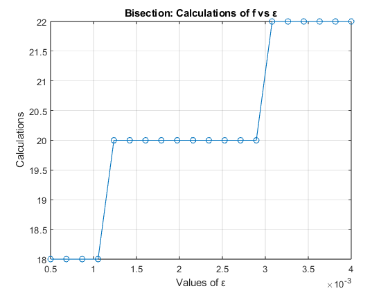

**Σχήμα 1.1.1.** Συνολικός αριθμός απαιτούμενων υπολογισμών της αντικειμενικής συνάρτησης συναρτήσει του $\epsilon$ κατά την εφαρμογή της μεθόδου της διχοτόμου στην $f_1$

**Σχήμα 1.1.2.** Συνολικός αριθμός απαιτούμενων υπολογισμών της αντικειμενικής συνάρτησης συναρτήσει του $\epsilon$ κατά την εφαρμογή της μεθόδου της διχοτόμου στην $f_2$

**Σχήμα 1.1.3.** Συνολικός αριθμός απαιτούμενων υπολογισμών της αντικειμενικής συνάρτησης συναρτήσει του $\epsilon$ κατά την εφαρμογή της μεθόδου της διχοτόμου στην $f_3$

Γίνεται αντιληπτό ότι όσο αυξάνεται η σταθερά $\epsilon$, δηλαδή όσο μεγαλύτερη γίνεται η απόσταση μεταξύ $x_1$ και $x_2$ ο απαιτούμενος αριθμός υπολογισμών της αντικειμενικής συνάρτησης αυξάνεται. Το παραπάνω εξηγείται εφόσον για μεγαλύτερο $\epsilon$ θα αποκλείουμε σε κάθε επανάληψη του αλγορίθμου μικρότερο μέρος του προηγούμενου διαστήματος αναζήτησης, ως εκ τούτου απαιτούνται περισσότερες επαναλήψεις.

### Υποερώτημα 2ο
Κρατώντας σταθερό το $\epsilon = 0.001$ παρατηρείται η εξής μεταβολή στον συνολικό αριθμό των απαιτούμενων υπολογισμών της αντικειμενικής συνάρτησης $f$ καθώς μεταβάλλεται το τελικό εύρος αναζήτησης $l$:

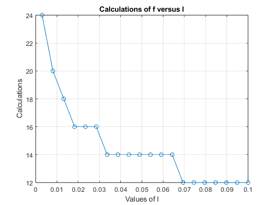

**Σχήμα 1.2.1.** Συνολικός αριθμός απαιτούμενων υπολογισμών της αντικειμενικής συνάρτησης συναρτήσει του $l$ κατά την εφαρμογή της μεθόδου της διχοτόμου στην $f_1$

**Σχήμα 1.2.2.** Συνολικός αριθμός απαιτούμενων υπολογισμών της αντικειμενικής συνάρτησης συναρτήσει του $l$ κατά την εφαρμογή της μεθόδου της διχοτόμου στην $f_2$

**Σχήμα 1.2.3.** Συνολικός αριθμός απαιτούμενων υπολογισμών της αντικειμενικής συνάρτησης συναρτήσει του $l$ κατά την εφαρμογή της μεθόδου της διχοτόμου στην $f_3$

Γίνεται αντιληπτό ότι όσο αυξάνεται το τελικό εύρος αναζήτησης $l$, δηλαδή όσο το διάστημα στο οποίο περιέχεται το ελάχιστο της $f$ γίνεται λιγότερο «αυστηρό» ο συνολικός αριθμός των απαιτούμενων υπολογισμών της αντικειμενικής συνάρτησης μειώνεται. Το παραπάνω εξηγείται εφόσον για μεγαλύτερο $l$ ο αλγόριθμος τερματίζει ύστερα από λιγότερες επαναλήψεις έτσι ο συνολικός αριθμός απαιτούμενων υπολογισμών της $f$ είναι μικρότερος.

### Υποερώτημα 3ο
Καθώς μεταβάλλεται η τιμή του τελικού εύρους αναζήτησης $l$ παρατηρείται η εξής μεταβολή στα άκρα του τελικού διαστήματος αναζήτησης $[\alpha, \beta]$:

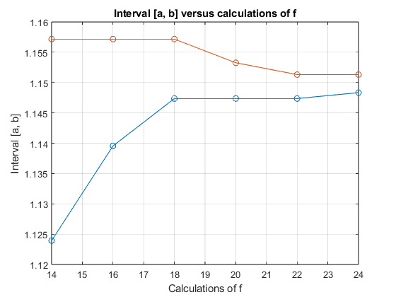

**Σχήμα 1.3.1.** Τελικό διάστημα αναζήτησης συναρτήσει του συνολικού αριθμού των απαιτούμενων υπολογισμών της αντικειμενικής συνάρτησης κατά την εφαρμογή της μεθόδου της διχοτόμου στην $f_1$

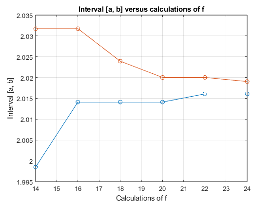

**Σχήμα 1.3.2.** Τελικό διάστημα αναζήτησης συναρτήσει του συνολικού αριθμού των απαιτούμενων υπολογισμών της αντικειμενικής συνάρτησης κατά την εφαρμογή της μεθόδου της διχοτόμου στην $f_2$

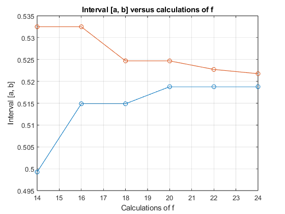

**Σχήμα 1.3.3.** Τελικό διάστημα αναζήτησης συναρτήσει του συνολικού αριθμού των απαιτούμενων υπολογισμών της αντικειμενικής συνάρτησης κατά την εφαρμογή της μεθόδου της διχοτόμου στην $f_3$

Γίνεται αντιληπτό ότι για μεγαλύτερους αριθμούς συνολικών υπολογισμών της $f$ τα άκρα του τελικού διαστήματος αναζήτησης $[\alpha, \beta]$ πλησιάζουν το ένα το άλλο. Το παραπάνω εξηγείται εφόσον μεγαλύτερος συνολικός αριθμός απαιτούμενων υπολογισμών της $f$ υποδηλώνει περισσότερες επαναλήψεις, δηλαδή μικρότερο τελικό διάστημα αναζήτησης.

### Πλεονεκτήματα / Μειονεκτήματα
Η μέθοδος διχοτόμου είναι ένας απλός και εύκολα κατανοητός αλγόριθμος εύρεσης ελαχίστου χωρίς την χρήση παραγώγων. Όπως θα γίνει εμφανές παρακάτω είναι αργός. Επιπλέον, σε κάθε επανάληψη απαιτούνται δύο υπολογισμοί της αντικειμενικής συνάρτησης $f$, το οποίο αποτελεί χαρακτηριστικό στο οποίο υστερεί σε σύγκριση με τις παρακάτω μεθόδους εύρεσης ελαχίστου.

## Θέμα 2ο
Το 2ο θέμα αφορά την εύρεση ελαχίστου κυρτής συνάρτησης $f$ σε διάστημα $[\alpha, \beta]$ εφαρμόζοντας την μέθοδο του χρυσού τομέα. Κατά την μέθοδο αυτή το διάστημα αναζήτησης $[\alpha, \beta]$ περιορίζεται σε $[x_1, \beta]$ εάν $f(x_1)>f(x_2)$ ή σε $[\alpha, x_2]$ εάν $f(x_1)<f(x_2)$. Τα $x_1$ και $x_2$ επιλέγονται έτσι ώστε το εύρος του καινούργιου υποδιαστήματος να συνδέεται κάθε φορά με το παλιό με μία σταθερά $\gamma$. Η σταθερά $\gamma$ προκύπτει ως θετική λύση της εξίσωσης $\gamma^2+\gamma+1=0$, δηλαδή $\gamma \approx 0.618$. Ο αλγόριθμος τερματίζει όταν το νέο διάστημα αναζήτησης γίνει μικρότερο από το προεπιλεγμένο εύρος $l > 0$. Το ελάχιστο της $f$ βρίσκεται εντός του νέου διαστήματος αναζήτησης.

### Υποερώτημα 1ο
Καθώς μεταβάλλεται η τιμή του τελικού εύρους αναζήτησης $l$ παρατηρείται η εξής μεταβολή στον συνολικό αριθμό απαιτούμενων υπολογισμών της αντικειμενικής συνάρτησης:

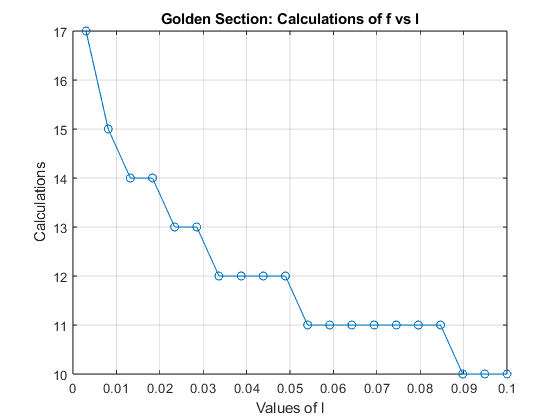

**Σχήμα 2.1.1.** Συνολικός αριθμός απαιτούμενων υπολογισμών της αντικειμενικής συνάρτησης συναρτήσει του $l$ κατά την εφαρμογή της μεθόδου του χρυσού τομέα στην $f_1$

**Σχήμα 2.1.2.** Συνολικός αριθμός απαιτούμενων υπολογισμών της αντικειμενικής συνάρτησης συναρτήσει του $l$ κατά την εφαρμογή της μεθόδου του χρυσού τομέα στην $f_2$

**Σχήμα 2.1.3.** Συνολικός αριθμός απαιτούμενων υπολογισμών της αντικειμενικής συνάρτησης συναρτήσει του $l$ κατά την εφαρμογή της μεθόδου του χρυσού τομέα στην $f_3$

Όπως και στην μέθοδο της διχοτόμου γίνεται αντιληπτό ότι όσο αυξάνεται το τελικό εύρος αναζήτησης $l$, δηλαδή όσο το διάστημα στο οποίο περιέχεται το ελάχιστο της $f$ γίνεται λιγότερο «αυστηρό» ο συνολικός αριθμός των απαιτούμενων υπολογισμών της αντικειμενικής συνάρτησης μειώνεται. Το παραπάνω εξηγείται εφόσον για μεγαλύτερο $l$ ο αλγόριθμος τερματίζει ύστερα από λιγότερες επαναλήψεις έτσι ο συνολικός αριθμός απαιτούμενων υπολογισμών της $f$ είναι μικρότερος.

### Υποερώτημα 2ο
Καθώς μεταβάλλεται η τιμή του τελικού εύρους αναζήτησης $l$ παρατηρείται η εξής μεταβολή στα άκρα του τελικού διαστήματος αναζήτησης $[\alpha, \beta]$:

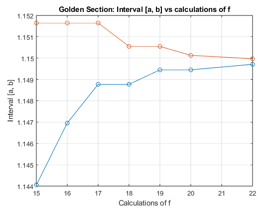

**Σχήμα 2.2.1.** Τελικό διάστημα αναζήτησης συναρτήσει του συνολικού αριθμού των απαιτούμενων υπολογισμών της αντικειμενικής συνάρτησης κατά την εφαρμογή της μεθόδου του χρυσού τομέα στην $f_1$

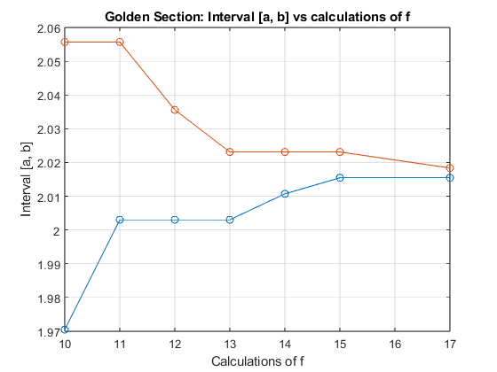

**Σχήμα 2.2.2.** Τελικό διάστημα αναζήτησης συναρτήσει του συνολικού αριθμού των απαιτούμενων υπολογισμών της αντικειμενικής συνάρτησης κατά την εφαρμογή της μεθόδου του χρυσού τομέα στην $f_2$

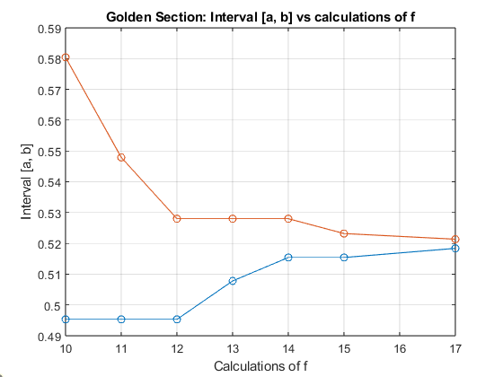

**Σχήμα 2.2.3.** Τελικό διάστημα αναζήτησης συναρτήσει του συνολικού αριθμού των απαιτούμενων υπολογισμών της αντικειμενικής συνάρτησης κατά την εφαρμογή της μεθόδου του χρυσού τομέα στην $f_3$

Όπως και στην μέθοδο διχοτόμου γίνεται αντιληπτό ότι για μεγαλύτερους αριθμούς συνολικών υπολογισμών της $f$ τα άκρα του τελικού διαστήματος αναζήτησης $[\alpha, \beta]$ πλησιάζουν το ένα το άλλο. Το παραπάνω εξηγείται εφόσον μεγαλύτερος αριθμός συνολικών υπολογισμών της $f$ υποδηλώνει περισσότερες επαναλήψεις, δηλαδή μικρότερο τελικό διάστημα αναζήτησης.

### Πλεονεκτήματα / Μειονεκτήματα
Η μέθοδος του χρυσού τομέα είναι ακόμα ένας αλγόριθμος που δεν κάνει χρήση παραγώγων. Αντίθετα με την μέθοδο της διχοτόμου ο λόγος μείωσης του διαστήματος αναζήτησης είναι σταθερός, το οποίο ελαττώνει της απαιτούμενες επαναλήψεις. Επιπλέον, σε κάθε νέα επανάληψη απαιτείται μόνο ένας υπολογισμός της αντικειμενικής συνάρτησης, αντί για δύο που απαιτούνται κατά την μέθοδο της διχοτόμου, συμβάλλοντας στην καλύτερη απόδοση του αλγορίθμου.

## Θέμα 3ο
Το 3ο θέμα αφορά την εύρεση ελαχίστου κυρτής συνάρτησης $f$ σε διάστημα $[\alpha, \beta]$ εφαρμόζοντας την μέθοδο Fibonacci. Κατά την μέθοδο αυτή το διάστημα αναζήτησης $[\alpha, \beta]$ περιορίζεται σε $[x_1, \beta]$ εάν $f(x_1)>f(x_2)$ ή σε $[\alpha, x_2]$ εάν $f(x_1)<f(x_2)$. Τα $x_1$ και $x_2$ επιλέγονται έτσι ώστε το διάστημα αναζήτησης να μειώνεται κατά $\frac{F_{n-k}}{F_{n-k+1}}$ σε κάθε επανάληψη. Ο αλγόριθμος τερματίζει μετά από $k = n-1$ επαναλήψεις, όπου $n$ τέτοιος ώστε $F_n> \frac{\beta - \alpha}{l}$ (όπου $F_n$ ο $n$-οστός όρος της σειράς Fibonacci). Το ελάχιστο της $f$ βρίσκεται εντός του νέου διαστήματος αναζήτησης.

Επειδή ο αριθμός $n$ εξαρτάται από το $l$, κατά την υλοποίηση της μεθόδου Fibonacci υπολογίζεται εκ των προτέρων $n$ τέτοιο ώστε ο $F_n$ να είναι ο πρώτος όρος της σειράς Fibonacci μεγαλύτερος από $\frac{\beta - \alpha}{l}$.

### Υποερώτημα 1ο
Καθώς μεταβάλλεται η τιμή του τελικού εύρους αναζήτησης $l$ παρατηρείται η εξής μεταβολή στον συνολικό αριθμό απαιτούμενων υπολογισμών της αντικειμενικής συνάρτησης:

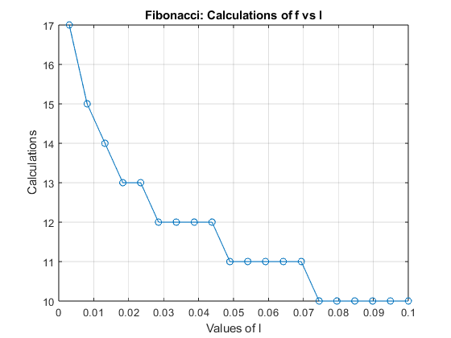

**Σχήμα 3.1.1.** Συνολικός αριθμός απαιτούμενων υπολογισμών της αντικειμενικής συνάρτησης συναρτήσει του $l$ κατά την εφαρμογή της μεθόδου Fibonacci στην $f_1$

**Σχήμα 3.1.2.** Συνολικός αριθμός απαιτούμενων υπολογισμών της αντικειμενικής συνάρτησης συναρτήσει του $l$ κατά την εφαρμογή της μεθόδου Fibonacci στην $f_2$

**Σχήμα 3.1.3.** Συνολικός αριθμός απαιτούμενων υπολογισμών της αντικειμενικής συνάρτησης συναρτήσει του $l$ κατά την εφαρμογή της μεθόδου Fibonacci στην $f_3$

Όπως και στις δύο προηγούμενες μεθόδους γίνεται αντιληπτό ότι όσο αυξάνεται το τελικό εύρος αναζήτησης $l$, δηλαδή όσο το διάστημα στο οποίο περιέχεται το ελάχιστο της $f$ γίνεται λιγότερο «αυστηρό» ο συνολικός αριθμός των απαιτούμενων υπολογισμών της αντικειμενικής συνάρτησης μειώνεται. Το παραπάνω εξηγείται εφόσον για μεγαλύτερο $l$ ο αλγόριθμος τερματίζει ύστερα από λιγότερες επαναλήψεις έτσι ο συνολικός αριθμός υπολογισμών της $f$ είναι μικρότερος.

### Υποερώτημα 2ο
Καθώς μεταβάλλεται η τιμή του τελικού εύρους αναζήτησης $l$ παρατηρείται η εξής μεταβολή στα άκρα του τελικού διαστήματος αναζήτησης $[\alpha, \beta]$:

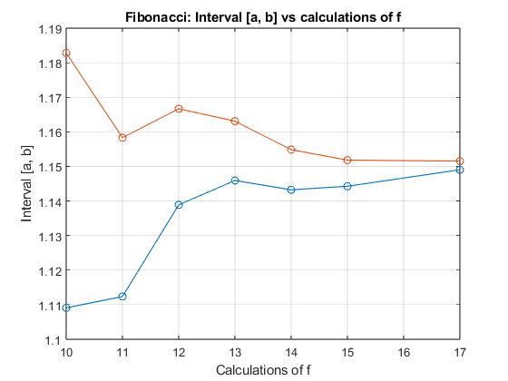

**Σχήμα 3.2.1.** Τελικό διάστημα αναζήτησης συναρτήσει του συνολικού αριθμού των απαιτούμενων υπολογισμών της αντικειμενικής συνάρτησης κατά την εφαρμογή της μεθόδου Fibonacci στην $f_1$

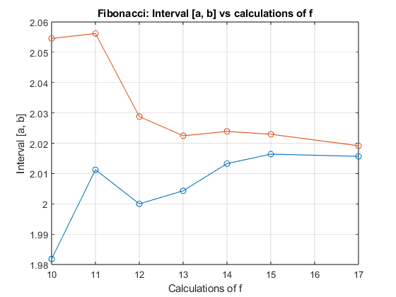

**Σχήμα 3.2.2.** Τελικό διάστημα αναζήτησης συναρτήσει του συνολικού αριθμού των απαιτούμενων υπολογισμών της αντικειμενικής συνάρτησης κατά την εφαρμογή της μεθόδου Fibonacci στην $f_2$

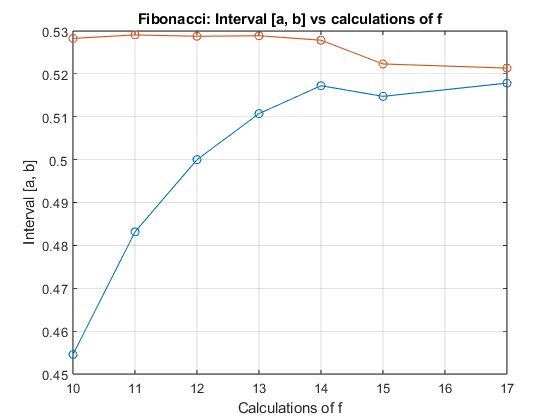

**Σχήμα 3.2.3.** Τελικό διάστημα αναζήτησης συναρτήσει του συνολικού αριθμού των απαιτούμενων υπολογισμών της αντικειμενικής συνάρτησης κατά την εφαρμογή της μεθόδου Fibonacci στην $f_3$

Όπως και στην μέθοδο διχοτόμου γίνεται αντιληπτό ότι για μεγαλύτερους αριθμούς συνολικών υπολογισμών της $f$ τα άκρα του τελικού διαστήματος αναζήτησης $[\alpha, \beta]$ πλησιάζουν το ένα το άλλο. Το παραπάνω εξηγείται εφόσον μεγαλύτερος αριθμός συνολικών υπολογισμών της $f$ υποδηλώνει περισσότερες επαναλήψεις, δηλαδή μικρότερο τελικό διάστημα αναζήτησης. Ενώ όμως οι καμπύλες $(k, \alpha_k)$ και $(k, \beta_k)$ αναμένονται να έχουν αύξουσα και φθίνουσα πορεία αντίστοιχα, κάτι τέτοιο δεν συμβαίνει, γεγονός το οποίο σχολιάζεται στην παρακάτω σημείωση.

### Σημείωση
Έπειτα από παρατήρηση μη αναμενόμενης συμπεριφοράς των καμπυλών $(k, \alpha_k)$ και $(k, \beta_k)$ εξετάστηκαν εκτενώς η συναρτήσεις Fibonacci και fibonacci_min.m οι οποίες υλοποιούν τον αλγόριθμο Fibonacci. Ενώ, λοιπόν, δεν εντοπίστηκε κάποιο σφάλμα στις δύο αυτές συναρτήσεις, δεν μπορεί να αποκλειστεί το ενδεχόμενο να υπάρχει.

Τροποποιώντας τις τελευταίες γραμμές της συνάρτησης task3_2.m όπως στο σχήμα παρακάτω, ώστε να φαίνεται η διαφορά $\alpha - \beta$ συναρτήσει του συνολικού αριθμού των απαιτούμενων υπολογισμών της $f$ παρατηρείται η εξής συμπεριφορά:

**Σχήμα 3.2.4.** Τροποποίηση της συνάρτησης task3_2.m

| 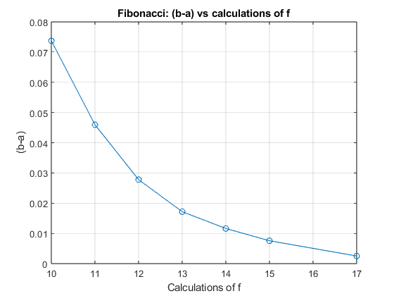 | 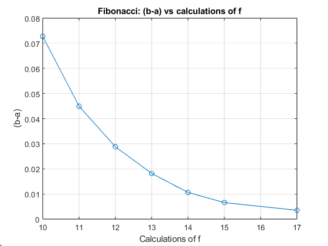 | 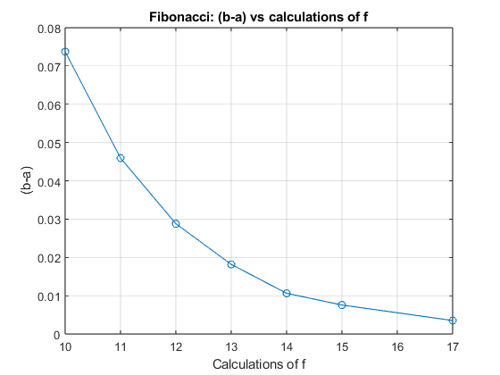 |
| --- | --- | --- |
| *Σχήμα 3.2.4a. f1* | *Σχήμα 3.2.4b. f2* | *Σχήμα 3.2.4c. f3* |

**Σχήμα 3.2.5.** Διαφορά $\alpha - \beta$ συναρτήσει του συνολικού αριθμού των απαιτούμενων υπολογισμών της αντικειμενικής συνάρτησης κατά την εφαρμογή της μεθόδου Fibonacci στις $f_1$, $f_2$ και $f_3$

Τα σχήματα 3.2.4a, 3.2.4b και 3.2.4c φανερώνουν ότι παρά την μη αναμενόμενη συμπεριφορά όσον αφορά τις καμπύλες $(k, \alpha_k)$ και $(k, \beta_k)$, το διάστημα $(\alpha, \beta)$ γίνεται όλο και πιο στενό όσο ο συνολικός αριθμός των απαιτούμενων υπολογισμών της αντικειμενικής συνάρτησης αυξάνεται. Λόγω λοιπόν της παραπάνω συμπεριφοράς και λόγω του γεγονότος ότι τα άκρα του διαστήματος $(\alpha, \beta)$ συγκλίνουν σε αριθμούς κοντινούς με το ελάχιστο της εκάστοτε συνάρτησης $f$, θεωρείται ότι οποιοδήποτε ενδεχόμενο σφάλμα κατά την υλοποίηση του αλγορίθμου Fibonacci μπορεί να αγνοηθεί κατά την αξιολόγηση των πλεονεκτημάτων και των μειωνεκτημάτων του συγκεκριμένου αλγόριθμου, καθώς και κατά το τελικό συμπέρασμα της παρούσας άσκησης.

### Πλεονεκτήματα / Μειονεκτήματα
Όπως και προηγουμένως ο αλγόριθμος Fibonacci δεν κάνει χρήση παραγώγων της $f$. Ομοίως με την μέθοδο του χρυσού τομέα ο λόγος μείωσης του διαστήματος αναζήτησης είναι σταθερός ενώ πάλι σε κάθε επανάληψη ο συνολικός αριθμός των απαιτούμενων υπολογισμών της $f$ αυξάνεται κατά ένα, χαρακτηριστικά τα οποία συμβάλλουν στην καλύτερη απόδοση του αλγορίθμου. Ο συγκεκριμένος αλγόριθμος μειονεκτεί στην απαιτητική φύση της υλοποίησής του, λόγω της χρήσης των αριθμών της ακολουθίας Fibonacci.

## Θέμα 4ο
Το 4ο θέμα αφορά την εύρεση ελαχίστου κυρτής συνάρτησης $f$ σε διάστημα $[\alpha, \beta]$ εφαρμόζοντας την μέθοδο της διχοτόμου με χρήση παραγώγων. Κατά την μέθοδο αυτή υπολογίζεται η παράγωγος της $f$ σε ένα σημείο $x_k$ του $[\alpha, \beta]$ και εν συνεχεία εάν $\frac{df(x)}{dx} \big|_{x = x_k} = 0$, τότε το $x_k$ είναι και ελάχιστο της $f$, αλλιώς εάν $\frac{df(x)}{dx} \big|_{x = x_k} > 0$ το διάστημα αναζήτησης μειώνεται σε $[\alpha, x_k]$, διαφορετικά εάν $\frac{df(x)}{dx} \big|_{x = x_k} < 0$ το διάστημα αναζήτησης μειώνεται σε $[x_k, \beta]$. Για να επιτευχτεί η βέλτιστη λειτουργία του αλγορίθμου το $x_k$ επιλέγεται ως το μέσον του $[\alpha, \beta]$, δηλαδή $x_k = \frac{\alpha+\beta}{2}$.

Για την υλοποίηση της παραγώγου σε Matlab χρησιμοποιήθηκε ο ορισμός $\frac{df(x)}{dx}\big|_{x = x_0} = \lim_{h\to 0} \frac{f(x_0+h)-f(x_0-h)}{2\cdot h}$, ορίζοντας την συνάρτηση $f_{der}(x)=\frac{f(x+h)-f(x-h)}{2\cdot h}$, με $h$ επιλεγμένο αρκούντως μικρό ($h = 10^{-5}$).

### Υποερώτημα 1ο
Καθώς μεταβάλλεται η τιμή του τελικού εύρους αναζήτησης $l$ παρατηρείται η εξής μεταβολή στον συνολικό αριθμό απαιτούμενων υπολογισμών της αντικειμενικής συνάρτησης:

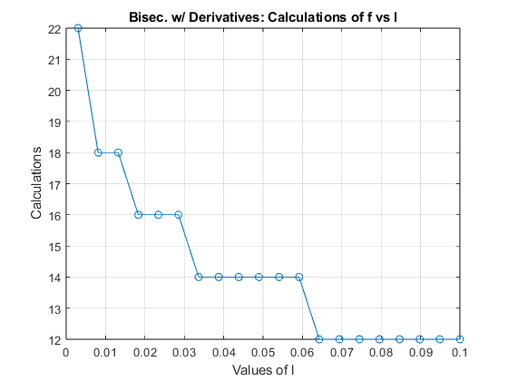

**Σχήμα 4.1.1.** Συνολικός αριθμός απαιτούμενων υπολογισμών της αντικειμενικής συνάρτησης συναρτήσει του $l$ κατά την εφαρμογή της μεθόδου της διχοτόμου με χρήση παραγώγων στην $f_1$

**Σχήμα 4.1.2.** Συνολικός αριθμός απαιτούμενων υπολογισμών της αντικειμενικής συνάρτησης συναρτήσει του $l$ κατά την εφαρμογή της μεθόδου της διχοτόμου με χρήση παραγώγων στην $f_2$

**Σχήμα 4.1.3.** Συνολικός αριθμός απαιτούμενων υπολογισμών της αντικειμενικής συνάρτησης συναρτήσει του $l$ κατά την εφαρμογή της μεθόδου της διχοτόμου με χρήση παραγώγων στην $f_3$

Όπως και στις προηγούμενες μεθόδους γίνεται αντιληπτό ότι όσο αυξάνεται το τελικό εύρος αναζήτησης $l$, δηλαδή όσο το διάστημα στο οποίο περιέχεται το ελάχιστο της $f$ γίνεται λιγότερο «αυστηρό» ο συνολικός αριθμός των απαιτούμενων υπολογισμών της αντικειμενικής συνάρτησης μειώνεται. Το παραπάνω εξηγείται εφόσον για μεγαλύτερο $l$ ο αλγόριθμος τερματίζει ύστερα από λιγότερες επαναλήψεις έτσι ο συνολικός αριθμός υπολογισμών της $f$ είναι μικρότερος.

### Υποερώτημα 2ο
Καθώς μεταβάλλεται η τιμή του τελικού εύρους αναζήτησης $l$ παρατηρείται η εξής μεταβολή στα άκρα του τελικού διαστήματος αναζήτησης $[\alpha, \beta]$:

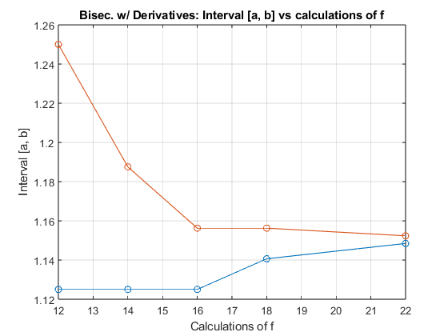

**Σχήμα 4.2.1.** Τελικό διάστημα αναζήτησης συναρτήσει του συνολικού αριθμού των απαιτούμενων υπολογισμών της αντικειμενικής συνάρτησης κατά την εφαρμογή της μεθόδου της διχοτόμου με χρήση παραγώγων στην $f_1$

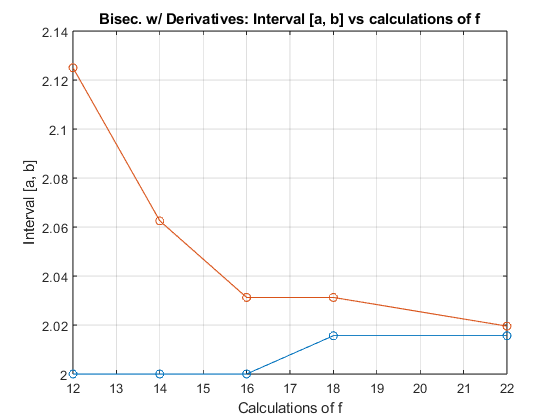

**Σχήμα 4.2.2.** Τελικό διάστημα αναζήτησης συναρτήσει του συνολικού αριθμού των απαιτούμενων υπολογισμών της αντικειμενικής συνάρτησης κατά την εφαρμογή της μεθόδου της διχοτόμου με χρήση παραγώγων στην $f_2$

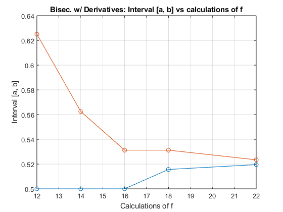

**Σχήμα 4.2.3.** Τελικό διάστημα αναζήτησης συναρτήσει του συνολικού αριθμού των απαιτούμενων υπολογισμών της αντικειμενικής συνάρτησης κατά την εφαρμογή της μεθόδου της διχοτόμου με χρήση παραγώγων στην $f_3$

Όπως και προηγουμένως γίνεται αντιληπτό ότι για μεγαλύτερους αριθμούς συνολικών υπολογισμών της $f$ τα άκρα του τελικού διαστήματος αναζήτησης $[\alpha, \beta]$ πλησιάζουν το ένα το άλλο. Το παραπάνω εξηγείται εφόσον μεγαλύτερος αριθμός συνολικών υπολογισμών της $f$ υποδηλώνει περισσότερες επαναλήψεις, δηλαδή μικρότερο τελικό διάστημα αναζήτησης.

### Πλεονεκτήματα / Μειονεκτήματα
Αντίθετα με τις προηγούμενες μεθόδους η συγκεκριμένη κάνει χρήση της παραγώγου της $f$. Λόγω του ορισμού της παραγώγου που επιλέχθηκε, κάθε φορά που απαιτείται υπολογισμός της παραγώγου η αντικειμενική συνάρτηση $f$ πρέπει να υπολογιστεί δύο φορές. Ως εκ τούτου ο συνολικός αριθμός απαιτούμενων υπολογισμών της $f$ αυξάνεται σε κάθε επανάληψη κατά δύο.

## Συμπεράσματα
Ύστερα από την παραπάνω ανάλυση προκύπτουν τα εξής συμπεράσματα:

Αρχικά, η μέθοδος της διχοτόμου χωρίς την χρήση παραγώγων είναι ένας απλός και εύκολα κατανοητός αλγόριθμος που εντοπίζει αρκούντως καλά διάστημα προεπιλεγμένου εύρους, στο οποίο ανήκει το ελάχιστο δοσμένης συνάρτησης $f$ χωρίς να απαιτεί την γνώση ή τον υπολογισμό των παραγώγων της. Λόγω του τρόπου υπολογισμού του νέου διαστήματος αναζήτησης, καθώς και του γεγονότος ότι απαιτούνται δύο υπολογισμοί της αντικειμενικής συνάρτησης σε κάθε καινούργια επανάληψη, η αποδοτικότητα του συγκεκριμένου αλγορίθμου κρίνεται να υστερεί συγκριτικά. Η επιλογή της μεθόδου της διχοτόμου χωρίς την χρήση παραγώγων είναι σκόπιμη όταν η απλοϊκότητα του αλγορίθμου είναι πιο σημαντική από την αποδοτικότητα.

Η μέθοδος του χρυσού τομέα αποτελεί επίσης αλγόριθμος που εντοπίζει αρκούντως καλά διάστημα προεπιλεγμένου εύρους, στο οποίο ανήκει το ελάχιστο δοσμένης συνάρτησης $f$ χωρίς να απαιτεί την γνώση ή τον υπολογισμό των παραγώγων της. Επεκτείνοντας την λογική της μεθόδου της διχοτόμου, η μέθοδος του χρυσού τομέα εισάγει την σταθερά $\gamma \approx 0.618$ στον υπολογισμό του νέου διαστήματος αναζήτησης, μειώνοντας το παλιό σύμφωνα με σταθερό λόγο, ενισχύοντας την αποδοτικότητα του αλγορίθμου. Το παραπάνω σε συνδυασμό με το γεγονός ότι απαιτείται ένας μόνο παραπάνω υπολογισμός της αντικειμενικής συνάρτησης σε κάθε επανάληψη καθιστούν την επιλογή της μεθόδου του χρυσού τομέα προτιμότερη από την μέθοδο της διχοτόμου.

Η μέθοδος Fibonacci ομοίως με τις δύο προηγούμενες εντοπίζει διάστημα, στο οποίο ανήκει το ελάχιστο δοσμένης συνάρτησης $f$ χωρίς να απαιτεί την γνώση ή τον υπολογισμό των παραγώγων της, ενώ διαφέρει στο γεγονός ότι ο αριθμός των επαναλήψεων $n$ επιλέγεται εκ των προτέρων. Όπως και κατά την μέθοδο του χρυσού τομέα το νέο διάστημα αναζήτησης συνδέεται με το παλιό σύμφωνα με σταθερό λόγο, ενώ ο συνολικός αριθμός των απαιτούμενων υπολογισμών της αντικειμενικής συνάρτησης αυξάνεται σε κάθε επανάληψη κατά ένα. Ενώ τα δύο παραπάνω συμβάλλουν στην καλύτερη απόδοση του αλγορίθμου, δεν μπορεί να παραληφθεί το γεγονός ότι η υλοποίηση του παρόντος αλγορίθμου ενέχει μία δυσκολία, λόγω της χρήσης των αριθμών της ακολουθίας Fibonacci.

Τέλος, η μέθοδος της διχοτόμου με χρήση παραγώγων διαφέρει από τις προηγούμενες στο γεγονός ότι απαιτεί την γνώση ή τον υπολογισμό της πρώτης παραγώγου της αντικειμενικής συνάρτησης, βάσει της οποίας επιλέγεται το νέο διάστημα αναζήτησης. Λόγω λοιπόν του τρόπου υπολογισμού της παραγώγου, που επιλέχτηκε κατά την υλοποίηση της μεθόδου στην παρούσα άσκηση και ως συνέπεια αυτού ότι απαιτούνται δύο επιπλέον υπολογισμοί της αντικειμενικής συνάρτησης σε κάθε επανάληψη, κρίνεται ότι η μέθοδος της διχοτόμου με χρήση παραγώγων υστερεί σε αποδοτικότητα συγκριτικά με τις προηγούμενες δύο μεθόδους.

Συμπερασματικά, βάσει των παραπάνω, εάν το ζητούμενο είναι η αποδοτικότητα του αλγορίθμου η επιλογή θα γίνει ανάμεσα στην μέθοδο του χρυσού τομέα και στην μέθοδο Fibonacci. Εάν επιπλέον δίνεται έμφαση στην εύκολη υλοποίηση της μεθόδου, η μέθοδος του χρυσού τομέα αποτελεί την συμφέρουσα επιλογή.
