# Τεχνικές Βελτιστοποίησης - 2η Εργαστηριακή Άσκηση

**Κατσάρος Ζήσης, 10666**  
**Χειμ. Εξάμηνο 2024-2025**

## Περιεχόμενα

- [Αρχεία Matlab](#archeia-matlab)
- [Εισαγωγή](#eisagogi)
- [Θέμα 1ο](#thema-1o)
- [Θέμα 2ο](#thema-2o)
	- [Υποερώτημα (α)](#ypoerotima-a-thema-2)
	- [Υποερώτημα (β)](#ypoerotima-b-thema-2)
	- [Υποερώτημα (γ)](#ypoerotima-g-thema-2)
- [Θέμα 3ο](#thema-3o)
	- [Υποερώτημα (α)](#ypoerotima-a-thema-3)
	- [Υποερώτημα (β)](#ypoerotima-b-thema-3)
	- [Υποερώτημα (γ)](#ypoerotima-g-thema-3)
- [Θέμα 4ο](#thema-4o)
	- [Υποερώτημα (α)](#ypoerotima-a-thema-4)
	- [Υποερώτημα (β)](#ypoerotima-b-thema-4)
	- [Υποερώτημα (γ)](#ypoerotima-g-thema-4)
- [Συμπεράσματα](#symperasmata)

## Αρχεία Matlab

Παρακάτω εξηγείται εν συντομία η λειτουργία κάθε αρχείου Matlab που χρησιμοποιήθηκε στα πλαίσια της 2ης εργαστηριακής άσκησης τεχνικών βελτιστοποίησης:

- **main.m:** Η κύρια συνάρτηση του project η οποία καλεί τις υπόλοιπες
- **task.m:** Οι συναρτήσεις με τίτλο τύπου "task.m" παραθέτουν τα ζητούμενα του εκάστοτε υποερωτήματος της εργαστηριακής άσκησης
- **grad_approx.m:** Υπολογίζει προσεγγιστικά την κλήση της $f$ σε συγκεκριμένο σημείο
- **steepest_descent_choose_gamma.m:** Υλοποιεί την μέθοδο της μέγιστης καθόδου με $\gamma$ σταθερό
- **choose_gamma.m:** Υπολογίζει $\gamma$ τέτοιο ώστε να ελαχιστοποιεί την $f(x_k+\gamma_kd_k)$
- **steepest_descent.m:** Υλοποιεί την μέθοδο της μέγιστης καθόδου με $\gamma$ τέτοιο ώστε να ελαχιστοποιεί την $f(x_k+\gamma_kd_k)$
- **armijo.m:** Υπολογίζει $\gamma$ σύμφωνα με τον κανόνα Armijo
- **steepest_descent_armijo.m:** Υλοποιεί την μέθοδο της μέγιστης καθόδου με $\gamma$ υπολογισμένο σύμφωνα με τον κανόνα Armijo
- **hes_approx.m:** Υπολογίζει προσεγγιστικά την λαπλασιανή της $f$ σε συγκεκριμένο σημείο
- **is_pos_definite.m:** Ελέγχει εάν δεδομένος πίνακας είναι θετικά ορισμένος
- **newton_min_choose_gamma.m:** Υλοποιεί την μέθοδο Newton με $\gamma$ σταθερό
- **newton_min.m:** Υλοποιεί την μέθοδο Newton με $\gamma$ τέτοιο ώστε να ελαχιστοποιεί την $f(x_k+\gamma_kd_k)$
- **newton_min_armijo.m:** Υλοποιεί την μέθοδο Newton με $\gamma$ υπολογισμένο σύμφωνα με τον κανόνα Armijo
- **levenberg_marquardt_choose_gamma.m:** Υλοποιεί την μέθοδο Levenberg-Marquardt με $\gamma$ σταθερό
- **levenberg_marquardt.m:** Υλοποιεί την μέθοδο Levenberg-Marquardt με $\gamma$ τέτοιο ώστε να ελαχιστοποιεί την $f(x_k+\gamma_kd_k)$
- **levenberg_marquardt_armijo.m:** Υλοποιεί την μέθοδο Levenberg-Marquardt με $\gamma$ υπολογισμένο σύμφωνα με τον κανόνα Armijo

## Εισαγωγή

Ζητούμενο της εργασίας είναι η ελαχιστοποίηση δοσμένης συνάρτησης πολλών μεταβλητών $f : \mathbb{R}^n \to \mathbb{R}$ χωρίς περιορισμούς κάνοντας χρήση αλγορίθμων που βασίζονται στην ιδέα της επαναληπτικής καθόδου. Θα χρησιμοποιηθούν η μέθοδος μέγιστης καθόδου, η μέθοδος Newton και η μέθοδος Levenberg-Marquardt. Επιπλέον η υπό μελέτη αντικειμενική συνάρτηση είναι η $f(x,y)=x^5e^{-x^2-y^2}$.

## Θέμα 1ο

Στο 1ο Θέμα ζητείται να σχεδιαστεί η αντικειμενική συνάρτηση $f$:

<figure>
	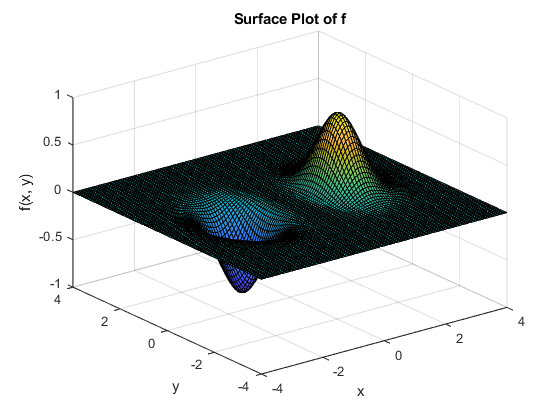
	<figcaption>Figure 1. f(x,y)=x^5e^{-x^2-y^2}</figcaption>
</figure>

Ύστερα από πράξεις το ελάχιστο της $f$ υπολογίζεται να είναι το σημείο $x_{min} = (-\frac{\sqrt{10}}{2}, 0)$, όπου $-\frac{\sqrt{10}}{2} \approx 1,58113883$, γεγονός που επιβεβαιώνεται (έστω ποιοτικά) από το παραπάνω σχήμα.

## Θέμα 2ο

Το 2ο θέμα αφορά την εύρεση ελαχίστου της αντικειμενικής συνάρτησης $f$ εφαρμόζοντας την μέθοδο της μέγιστης καθόδου.

### Υποερώτημα (α)

Αρχικά, θα εφαρμοστεί η μέθοδος της μέγιστης καθόδου με $\gamma$ σταθερό. Εδώ επιλέχθηκε $\gamma = 0.1$. Παρακάτω παραθέτονται το εκάστοτε ελάχιστο που υπολογίστηκε από τον αλγόριθμο και η γραφική παράσταση της σύγκλισης της αντικειμενικής συνάρτησης ως προς τον αριθμό των απαιτούμενων επαναλήψεων για την περίπτωση που για αρχικό σημείο επιλέχθηκε το (0, 0), (-1, 1) και (1, -1) αντίστοιχα:

- Με $(x_0, y_0) = (0, 0)$: $x_{min} = (0.00000, 0.00000)$
- Με $(x_0, y_0) = (-1, 1)$: $x_{min} = (-1.58114, 0.00005)$
- Με $(x_0, y_0) = (1, -1)$: $x_{min} = (0.10195, -1.29392)$

**Σημείωση**  
Για αρχικό σημείο $(x_0, y_0) = (0, 0)$ καθένας από τους υπό μελέτη αλγορίθμους που θα εφαρμοστούν στα πλαίσια αυτής της άσκησης τερματίζει απευθείας (γεγονός το οποίο θα σχολιαστεί παρακάτω). Επομένως, θεωρείται περιττή η προσθήκη γραφικής παράστασης της σύγκλισης της αντικειμενικής συνάρτησης ως προς τον αριθμό των απαιτούμενων επαναλήψεων για αρχικό σημείο το (0, 0) και έτσι θα παραλείπεται.

<figure>
	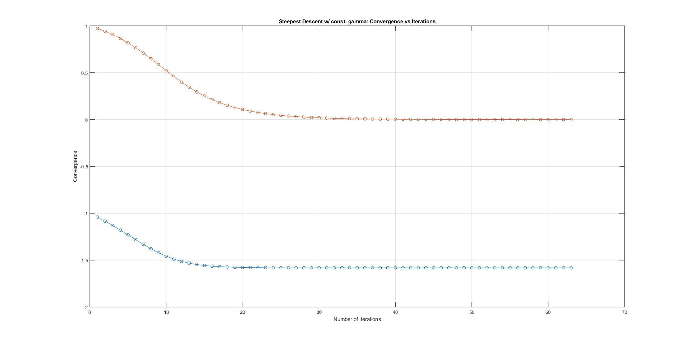
	<figcaption>Figure 2. Σύγκλισης της αντικειμενικής συνάρτησης ως προς τον αριθμό των απαιτούμενων επαναλήψεων κατά την εφαρμογή της μεθόδου της μέγιστης καθόδου με σταθερό $\gamma$ και αρχικό σημείο το (-1, 1)</figcaption>
</figure>

<figure>
	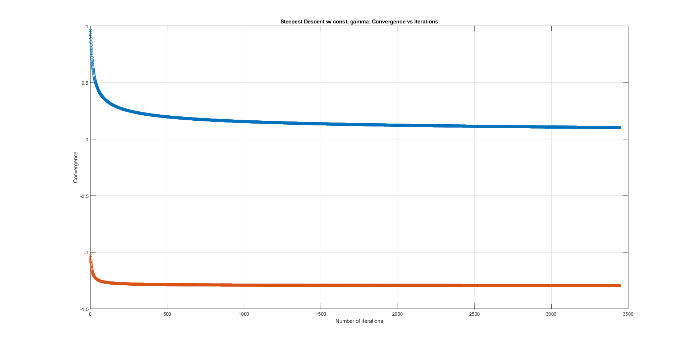
	<figcaption>Figure 3. Σύγκλισης της αντικειμενικής συνάρτησης ως προς τον αριθμό των απαιτούμενων επαναλήψεων κατά την εφαρμογή της μεθόδου της μέγιστης καθόδου με σταθερό $\gamma$ και αρχικό σημείο το (1, -1)</figcaption>
</figure>

### Παρατηρήσεις

Έχοντας εφαρμόσει την μέθοδο της μέγιστης καθόδου με σταθερό $\gamma$ στην αντικειμενική συνάρτηση $f$ ξεκινώντας από τα τρία παραπάνω αρχικά σημεία μπορούν να γίνουν οι εξής παρατηρήσεις:  
Κατ' αρχάς, πρέπει να σχολιαστεί η συμπεριφορά του αλγορίθμου όταν επιλέγεται για αρχικό σημείο το (0, 0). Ο συγκεκριμένος αλγόριθμος τερματίζει όταν το μέτρο της κλήσης της $f$ υπολογισμένο στο $x_k$ είναι μικρότερο από την παράμετρο $\epsilon$. Επειδή, λοιπόν, ισχύει ότι για $x_k = x_0 = (0, 0)$ το μέτρο της κλήσης της $f$ θα είναι $|\nabla f(x_k)| = 0 <\epsilon$ ο αλγόριθμος θα τερματίσει χωρίς να πραγματοποιήσει καμία επανάληψη και θα επιστρέψει εσφαλμένα το (0, 0) σαν ελάχιστο της συνάρτησης. Η συμπεριφορά αυτή, όπως θα γίνει εμφανές παρακάτω αφορά όχι μόνο τον συγκεκριμένο αλγόριθμο αλλά καθέναν από τους υπό μελέτη αλγορίθμους της συγκεκριμένης άσκησης ανεξαρτήτως του τρόπου επιλογής του $\gamma$.  
Προχωρώντας παρακάτω, παρατηρείται πως εάν επιλεγεί το (-1, 1) για αρχικό σημείο ο αλγόριθμος προσεγγίζει αρκούντως καλά το ελάχιστο της $f$ ύστερα από σχετικά μεγάλο αριθμό επαναλήψεων. Αντιθέτως, για αρχικό σημείο το (1, -1) ο αλγόριθμος συγκλίνει σε ένα σημείο διαφορετικό από το ελάχιστο της $f$. Αυτή η διαφορά στην ορθότητα του αποτελέσματος του αλγορίθμου αποδίδεται στο γεγονός ότι ενώ το (-1, 1) βρίσκεται κοντά στο ελάχιστο της $f$ κι έτσι ο αλγόριθμος μπορεί και συγκλίνει στο σωστό σημείο, το (1, -1) βρίσκεται αρκετά μακρύτερα από το ελάχιστο της $f$ κι έτσι ο αλγόριθμος τερματίζει πρώτου βρει το ελάχιστο, σε ένα σημείο όπου το μέτρο της κλήσης της $f$ γίνεται μικρότερο από το $\epsilon$.

### Υποερώτημα (β)

Στην συνέχεια, θα εφαρμοστεί η μέθοδος της μέγιστης καθόδου με $\gamma$ τέτοιο ώστε να ελαχιστοποιεί την $f(x_k+\gamma_kd_k)$. Τα αποτελέσματα παραθέτονται παρακάτω:

- Με $(x_0, y_0) = (0, 0)$: $x_{min} = (0.00000, 0.00000)$
- Με $(x_0, y_0) = (-1, 1)$: $x_{min} = (-1.58115, 0.00004)$
- Με $(x_0, y_0) = (1, -1)$: $x_{min} = (-1.58116, -0.00001)$

<figure>
	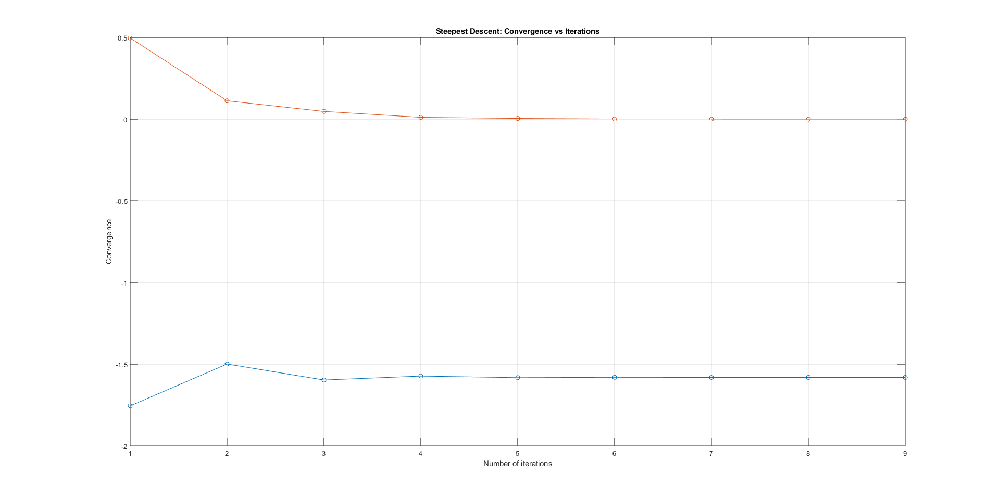
	<figcaption>Figure 4. Σύγκλισης της αντικειμενικής συνάρτησης ως προς τον αριθμό των απαιτούμενων επαναλήψεων κατά την εφαρμογή της μεθόδου της μέγιστης καθόδου με $\gamma$ τ.ώ. να ελαχιστοποιεί την $f(x_k+\gamma_kd_k)$ και αρχικό σημείο το (-1, 1)</figcaption>
</figure>

<figure>
	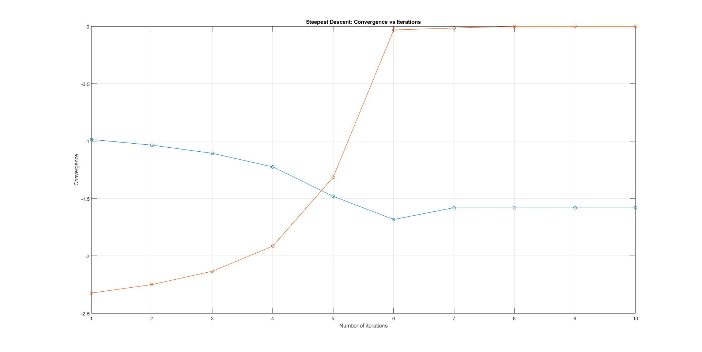
	<figcaption>Figure 5. Σύγκλισης της αντικειμενικής συνάρτησης ως προς τον αριθμό των απαιτούμενων επαναλήψεων κατά την εφαρμογή της μεθόδου της μέγιστης καθόδου με $\gamma$ τ.ώ. να ελαχιστοποιεί την $f(x_k+\gamma_kd_k)$ και αρχικό σημείο το (1, -1)</figcaption>
</figure>

### Παρατηρήσεις

Αρχικά, ομοίως με την περίπτωση της επιλογής σταθερού $\gamma$, παρατηρείται το ίδιο εσφαλμένο αποτέλεσμα για αρχικό σημείο το (0, 0). Για τα άλλα δύο αρχικά σημεία, παρατηρείται σύγκλιση στο ελάχιστο της $f$ με μικρή απόκλιση μετά το 4ο δεκαδικό ψηφίο έπειτα από λίγες μόνο επαναλήψεις.

### Υποερώτημα (γ)

Τέλος, θα εφαρμοστεί η μέθοδος της μέγιστης καθόδου με $\gamma$ επιλεγμένο βάσει του κανόνα Armijo. Τα αποτελέσματα παραθέτονται παρακάτω:

- Με $(x_0, y_0) = (0, 0)$: $x_{min} = (0.00000, 0.00000)$
- Με $(x_0, y_0) = (-1, 1)$: $x_{min} = (-1.58115, -0.00000)$
- Με $(x_0, y_0) = (1, -1)$: $x_{min} = (-1.58116, -0.00001)$

<figure>
	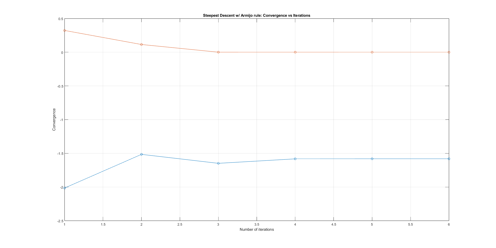
	<figcaption>Figure 6. Σύγκλισης της αντικειμενικής συνάρτησης ως προς τον αριθμό των απαιτούμενων επαναλήψεων κατά την εφαρμογή της μεθόδου της μέγιστης καθόδου με $\gamma$ σύμφωνα με τον κανόνα Armijo και αρχικό σημείο το (-1, 1)</figcaption>
</figure>

<figure>
	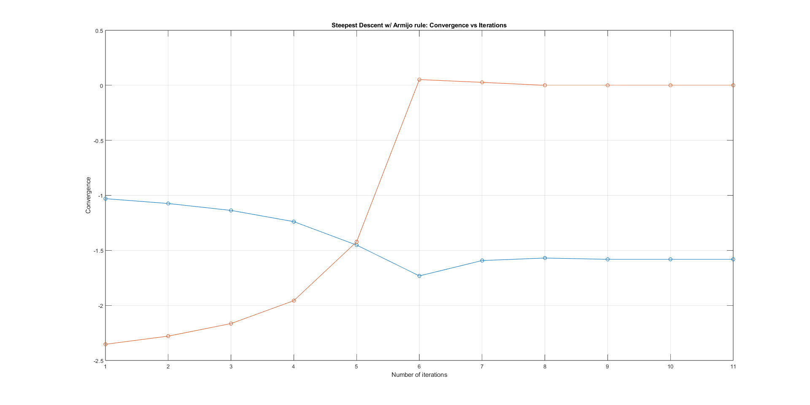
	<figcaption>Figure 7. Σύγκλισης της αντικειμενικής συνάρτησης ως προς τον αριθμό των απαιτούμενων επαναλήψεων κατά την εφαρμογή της μεθόδου της μέγιστης καθόδου με $\gamma$ σύμφωνα με τον κανόνα Armijo και αρχικό σημείο το (1, -1)</figcaption>
</figure>

### Παρατηρήσεις

Ομοίως με τις δύο προηγούμενες περιπτώσεις, παρατηρείται η ίδια συμπεριφορά για αρχικό σημείο το (0, 0). Όσον αφορά τα σημεία (-1, 1) και (1, -1) υπάρχει μικρή απόκλιση στο ελάχιστο μετά το 4ο δεκαδικό ψηφίο, ενώ ο αλγόριθμος τερματίζει ύστερα από περίπου τον ίδιο αριθμό επαναλήψεων με την προηγούμενη περίπτωση.

**Σημείωση**  
Πρέπει να έχει γίνει σαφές πως για αρχικό σημείο το (0, 0) το αποτέλεσμα που θα δώσει οποιοσδήποτε από τους υπό μελέτη αλγορίθμους θα είναι εσφαλμένα το (0, 0). Κάθε αναφορά, λοιπόν, στα αρχικά σημεία στις επόμενες ενότητες θα αφορά αποκλειστικά τα σημεία (-1, 1) και (1, -1). Για το σημείο (0, 0) θα γίνει λόγος λεπτομερέστερα στην τελευταία ενότητα, όπου θα υπάρξει σύγκριση μεταξύ των αλγορίθμων, της επιλογής του $\gamma$ και του αρχικού σημείου.

## Θέμα 3ο

Το 3ο θέμα αφορά την εύρεση ελαχίστου της αντικειμενικής συνάρτησης $f$ εφαρμόζοντας την μέθοδο Newton.

### Υποερώτημα (α)

Αρχικά, ζητείται να εφαρμοστεί η μέθοδος Newton με $\gamma$ σταθερό. Εδώ επιλέχθηκε $\gamma = 0.1$. Προϋπόθεση της συγκεκριμένης μεθόδου είναι ο εσσιανός πίνακας της $f$ υπολογισμένος στο εκάστοτε $x_k$ να είναι θετικά ορισμένος. Για τα αρχικά σημεία (-1, 1) και (1, -1), όμως, κάτι τέτοιο δεν ισχύει. Ως εκ τούτου, ο αλγόριθμος, ύστερα από έλεγχο της παραπάνω ιδιότητας και αφότου διαπιστώσει ότι η εν λόγω προϋπόθεση δεν πληρείται, τερματίζει.

Για να μελετηθεί η σύγκλιση της αντικειμενικής συνάρτησης όταν επιλέγονται για αρχικά σημεία τα (-1, 1) και (1, -1) αφαιρέθηκαν από την συνάρτηση "newton_min_choose_gamma.m" οι γραμμές 31 έως 36. Τα αποτελέσματα παραθέτονται παρακάτω:

<figure>
	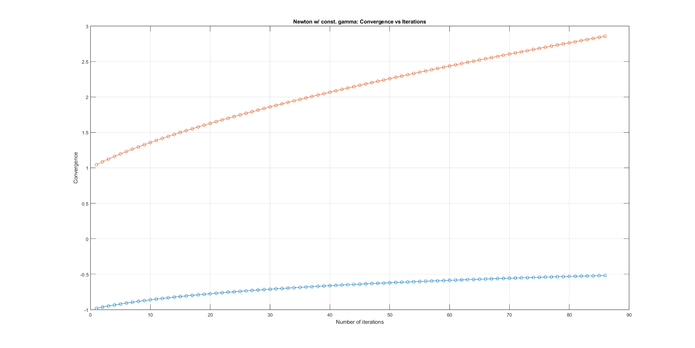
	<figcaption>Figure 8. Σύγκλισης της αντικειμενικής συνάρτησης ως προς τον αριθμό των απαιτούμενων επαναλήψεων κατά την εφαρμογή της μεθόδου Newton με σταθερό $\gamma$ και αρχικό σημείο το (-1, 1)</figcaption>
</figure>

<figure>
	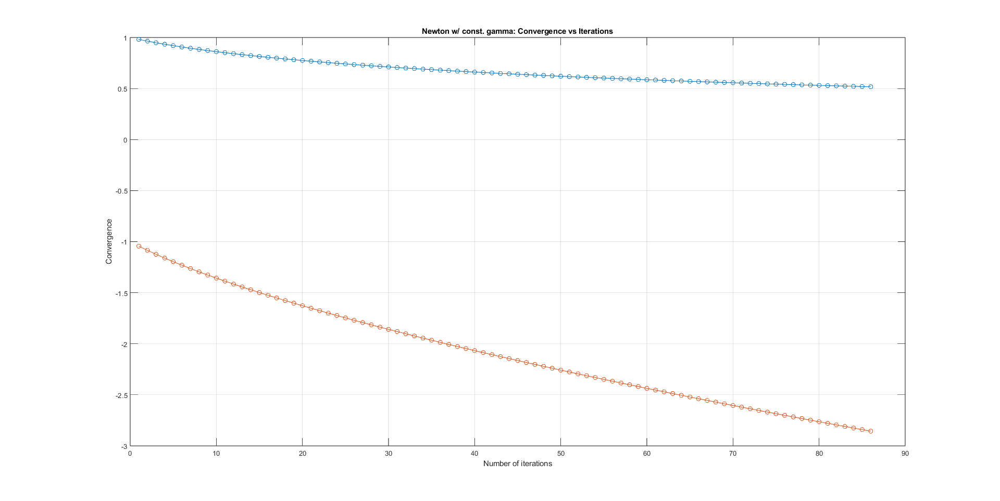
	<figcaption>Figure 9. Σύγκλισης της αντικειμενικής συνάρτησης ως προς τον αριθμό των απαιτούμενων επαναλήψεων κατά την εφαρμογή της μεθόδου Newton με σταθερό $\gamma$ και αρχικό σημείο το (1, -1)</figcaption>
</figure>

### Παρατηρήσεις

Όσον αφορά τα αρχικά σημεία (-1, 1) και (1, -1) ο αλγόριθμος συγκλίνει μεν, σε σημεία διαφορετικά από το ελάχιστο της $f$ δε.

### Υποερώτημα (β)

Εν συνεχεία, ζητείται να εφαρμοστεί η μέθοδος Newton με $\gamma$ τέτοιο ώστε να ελαχιστοποιεί την $f(x_k+\gamma_kd_k)$. Για αρχικό σημείο είτε το (-1, 1), είτε το (1, -1) παρατηρείται το ίδιο φαινόμενο όπως και στην περίπτωση της εφαρμογής της μεθόδου Newton με σταθερό $\gamma$, δηλαδή ο εσσιανός πίνακας της αντικειμενικής συνάρτησης να μην είναι θετικά ορισμένος. Ο αλγόριθμος τερματίζει μετά από έλεγχο του παραπάνω.

Για να μελετηθεί η σύγκλιση της αντικειμενικής συνάρτησης όταν επιλέγονται για αρχικά σημεία τα (-1, 1) και (1, -1) αφαιρέθηκαν από την συνάρτηση "newton_min.m" οι γραμμές 29 έως 34. Τα αποτελέσματα παραθέτονται παρακάτω:

<figure>
	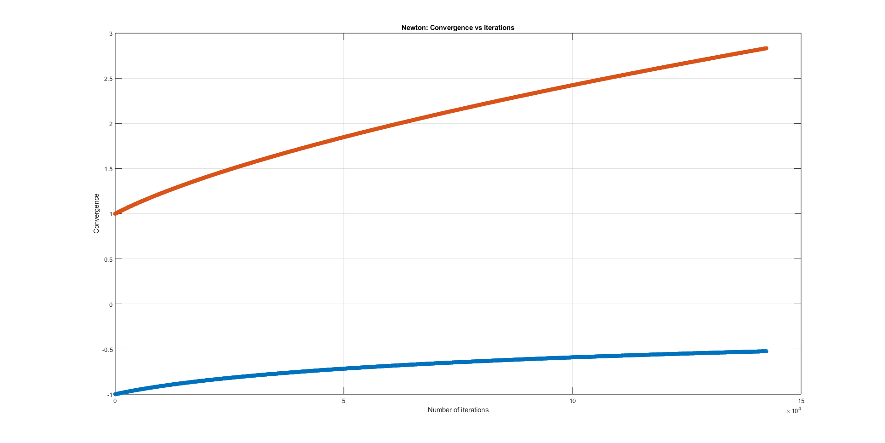
	<figcaption>Figure 10. Σύγκλισης της αντικειμενικής συνάρτησης ως προς τον αριθμό των απαιτούμενων επαναλήψεων κατά την εφαρμογή της μεθόδου Newton με $\gamma$ τ.ώ. να ελαχιστοποιεί την $f(x_k+\gamma_kd_k)$ και αρχικό σημείο το (-1, 1)</figcaption>
</figure>

<figure>
	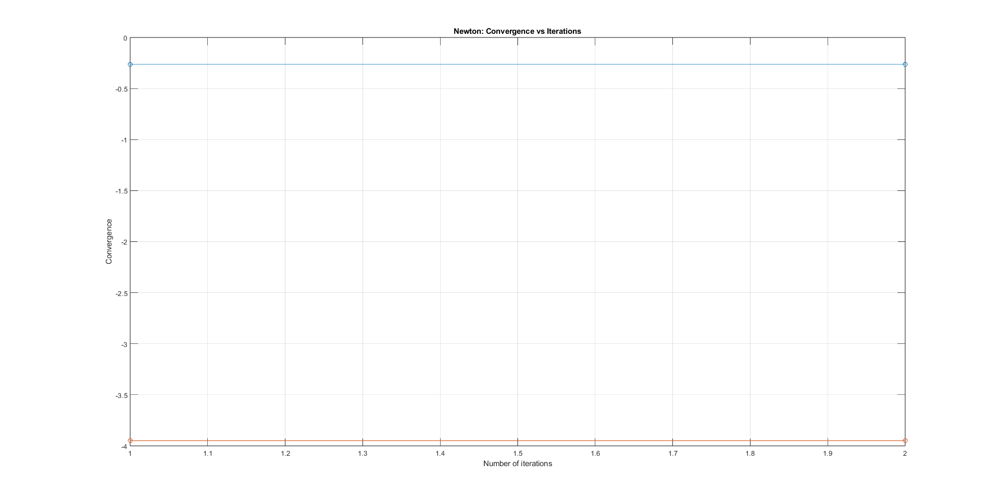
	<figcaption>Figure 11. Σύγκλισης της αντικειμενικής συνάρτησης ως προς τον αριθμό των απαιτούμενων επαναλήψεων κατά την εφαρμογή της μεθόδου Newton με $\gamma$ τ.ώ. να ελαχιστοποιεί την $f(x_k+\gamma_kd_k)$ και αρχικό σημείο το (1, -1)</figcaption>
</figure>

### Παρατηρήσεις

Πρώτον, για επιλογή αρχικού σημείου το (-1, 1) παρατηρείται ότι η συνάρτηση συγκλίνει σε σημείο διάφορο του ελαχίστου της μετά από εξαψήφιο αριθμό επαναλήψεων. Για αρχικό σημείο το (1, -1) ο αλγόριθμος συγκλίνει επίσης σε σημείο διάφορο του ελαχίστου της, αυτήν την φορά, όμως, μετά από μόνο δύο επαναλήψεις.

### Υποερώτημα (γ)

Τέλος, ζητείται να εφαρμοστεί η μέθοδος Newton με $\gamma$ επιλεγμένο βάσει του κανόνα Armijo. Όπως και πριν, ο εσσιανός πίνακας της αντικειμενικής συνάρτησης δεν είναι θετικά ορισμένος, επομένως ο αλγόριθμος δεν θα προχωρήσει.

Για να μελετηθεί η σύγκλιση της αντικειμενικής συνάρτησης όταν επιλέγονται για αρχικά σημεία τα (-1, 1) και (1, -1) αφαιρέθηκαν από την συνάρτηση "newton_min_armijo.m" οι γραμμές 29 έως 34. Τα αποτελέσματα παραθέτονται παρακάτω:

<figure>
	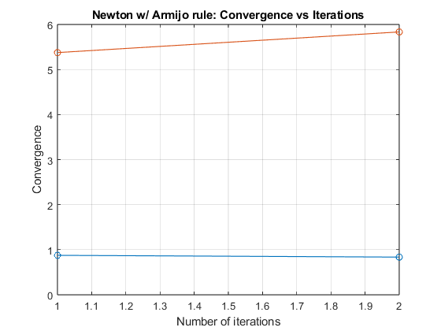
	<figcaption>Figure 12. Σύγκλισης της αντικειμενικής συνάρτησης ως προς τον αριθμό των απαιτούμενων επαναλήψεων κατά την εφαρμογή της μεθόδου Newton με $\gamma$ σύμφωνα με τον κανόνα Armijo και αρχικό σημείο το (-1, 1)</figcaption>
</figure>

<figure>
	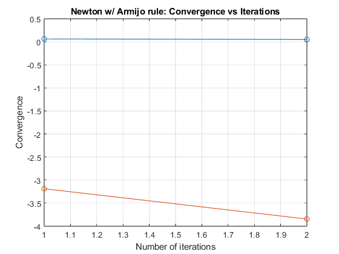
	<figcaption>Figure 13. Σύγκλισης της αντικειμενικής συνάρτησης ως προς τον αριθμό των απαιτούμενων επαναλήψεων κατά την εφαρμογή της μεθόδου Newton με $\gamma$ σύμφωνα με τον κανόνα Armijo και αρχικό σημείο το (1, -1)</figcaption>
</figure>

### Παρατηρήσεις

Και στις δύο περιπτώσεις, δηλαδή για αρχικό σημείο είτε το (-1, 1), είτε το (1, -1), παρατηρείται σύγκλιση σε σημείο διάφορο του ελαχίστου της $f$ μετά από δύο επαναλήψεις.

## Θέμα 4ο

Το τελευταίο θέμα αφορά την εύρεση ελαχίστου της αντικειμενικής συνάρτησης $f$ εφαρμόζοντας την μέθοδο Levenberg-Marquardt.

### Υποερώτημα (α)

Όπως και στα προηγούμενα θέματα, έτσι και σε αυτό θα εφαρμοστεί αρχικά η μέθοδος Levenberg-Marquardt με $\gamma$ σταθερό. Εδώ επιλέχθηκε $\gamma = 0.1$. Τα αποτελέσματα παραθέτονται παρακάτω:

- Με $(x_0, y_0) = (0, 0)$: $x_{min} = (0.00000, 0.00000)$
- Με $(x_0, y_0) = (-1, 1)$: $x_{min} = (-33834.69398, -33832.67842)$
- Με $(x_0, y_0) = (1, -1)$: $x_{min} = (0.09202, -1.13958)$

<figure>
	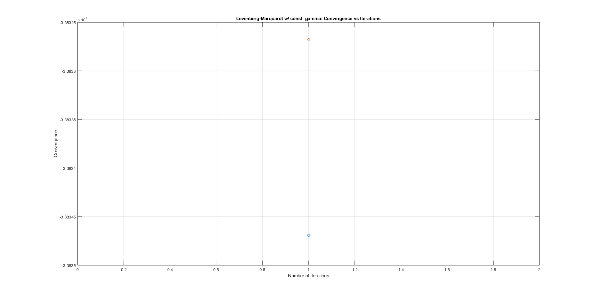
	<figcaption>Figure 14. Σύγκλισης της αντικειμενικής συνάρτησης ως προς τον αριθμό των απαιτούμενων επαναλήψεων κατά την εφαρμογή της μεθόδου Levenberg-Marquardt με σταθερό $\gamma$ και αρχικό σημείο το (-1, 1)</figcaption>
</figure>

<figure>
	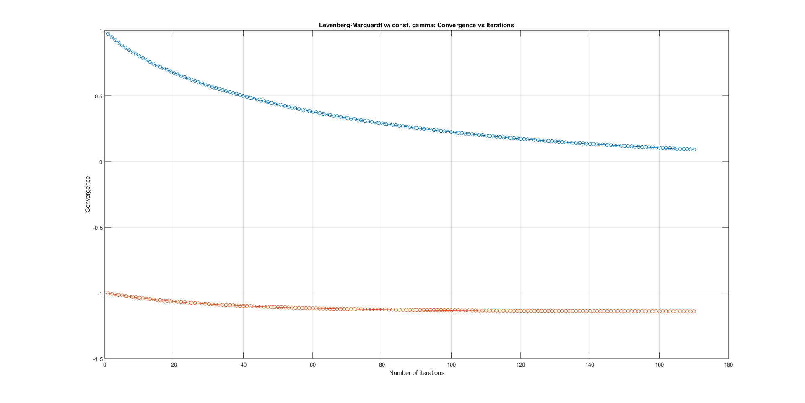
	<figcaption>Figure 15. Σύγκλισης της αντικειμενικής συνάρτησης ως προς τον αριθμό των απαιτούμενων επαναλήψεων κατά την εφαρμογή της μεθόδου Levenberg-Marquardt με σταθερό $\gamma$ και αρχικό σημείο το (1, -1)</figcaption>
</figure>

### Παρατηρήσεις

Τα αποτελέσματα που επιστρέφει ο αλγόριθμος Levenberg-Marquardt όταν το $\gamma$ επιλέγεται σταθερό, ίσο με $0.1$ είναι εμφανώς λάθος. Το παραπάνω μπορεί να αποδοθεί στο γεγονός ότι για $\gamma$ σταθερό δεν διασφαλίζεται ότι θα πληρούνται τα Κριτήρια 3 και 4 του Θεωρήματος 5.2.6, όπως αναγράφεται στο 4ο βήμα του αλγορίθμου.

### Υποερώτημα (β)

Μετέπειτα, ζητείται να εφαρμοστεί η μέθοδος Levenberg-Marquardt με $\gamma$ τέτοιο ώστε να ελαχιστοποιεί την $f(x_k+\gamma_kd_k)$. Τα αποτελέσματα παραθέτονται παρακάτω:

- Με $(x_0, y_0) = (0, 0)$: $x_{min} = (0.00000, 0.00000)$
- Με $(x_0, y_0) = (-1, 1)$: $x_{min} = (-1.58114, -0.00000)$
- Με $(x_0, y_0) = (1, -1)$: $x_{min} = (-1.58114, -0.00000)$

<figure>
	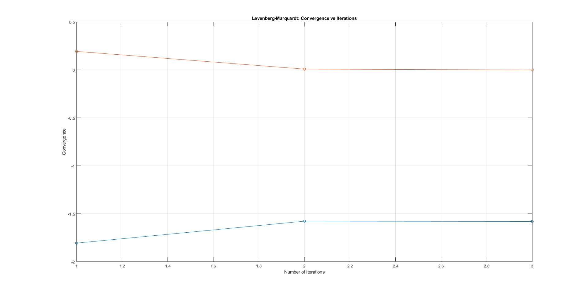
	<figcaption>Figure 16. Σύγκλισης της αντικειμενικής συνάρτησης ως προς τον αριθμό των απαιτούμενων επαναλήψεων κατά την εφαρμογή της μεθόδου Levenberg-Marquardt με $\gamma$ τ.ώ. να ελαχιστοποιεί την $f(x_k+\gamma_kd_k)$ και αρχικό σημείο το (-1, 1)</figcaption>
</figure>

<figure>
	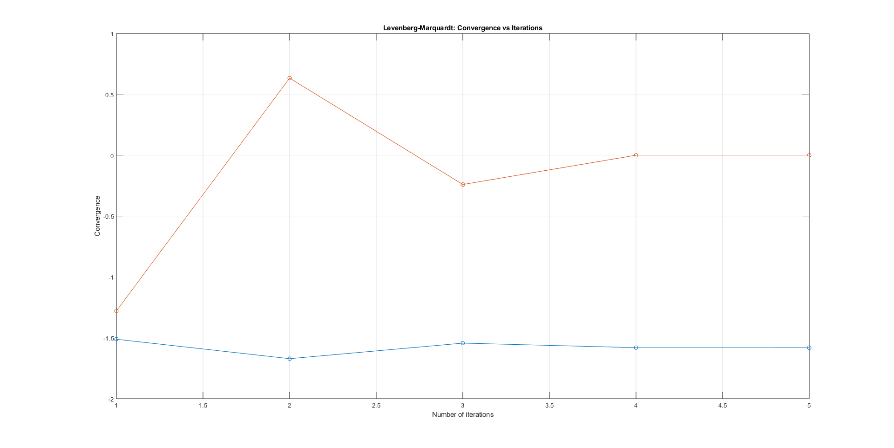
	<figcaption>Figure 17. Σύγκλισης της αντικειμενικής συνάρτησης ως προς τον αριθμό των απαιτούμενων επαναλήψεων κατά την εφαρμογή της μεθόδου Levenberg-Marquardt με $\gamma$ τ.ώ. να ελαχιστοποιεί την $f(x_k+\gamma_kd_k)$ και αρχικό σημείο το (1, -1)</figcaption>
</figure>

### Παρατηρήσεις

Κατά την εφαρμογή της μεθόδου Levenberg-Marquardt με $\gamma$ τέτοιο ώστε να ελαχιστοποιεί την $f(x_k+\gamma_kd_k)$ με αρχικά σημεία τα (-1, 1) και (1, -1) παρατηρείται σύγκλιση στο ελάχιστο της αντικειμενικής συνάρτησης $f$ και μάλιστα ύστερα από πολύ λίγες επαναλήψεις.

### Υποερώτημα (γ)

Τέλος, ζητείται να εφαρμοστεί η μέθοδος Levenberg-Marquardt με $\gamma$ επιλεγμένο βάσει του κανόνα Armijo. Τα αποτελέσματα παραθέτονται παρακάτω:

- Με $(x_0, y_0) = (0, 0)$: $x_{min} = (0.00000, 0.00000)$
- Με $(x_0, y_0) = (-1, 1)$: $x_{min} = (-1.58113, -0.00003)$
- Με $(x_0, y_0) = (1, -1)$: $x_{min} = (-1.58114, 0.00004)$

<figure>
	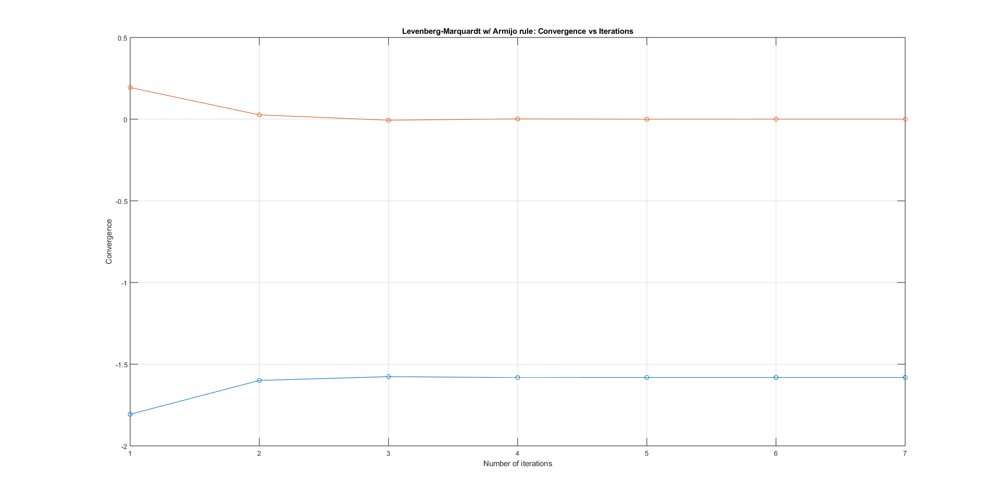
	<figcaption>Figure 18. Σύγκλισης της αντικειμενικής συνάρτησης ως προς τον αριθμό των απαιτούμενων επαναλήψεων κατά την εφαρμογή της μεθόδου Levenberg-Marquardt με $\gamma$ σύμφωνα με τον κανόνα Armijo και αρχικό σημείο το (-1, 1)</figcaption>
</figure>

<figure>
	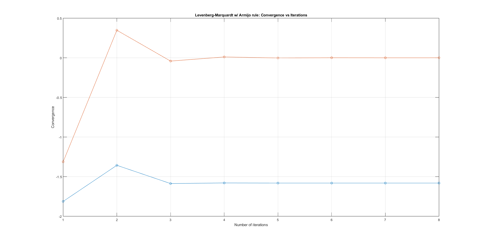
	<figcaption>Figure 19. Σύγκλισης της αντικειμενικής συνάρτησης ως προς τον αριθμό των απαιτούμενων επαναλήψεων κατά την εφαρμογή της μεθόδου Levenberg-Marquardt με $\gamma$ σύμφωνα με τον κανόνα Armijo και αρχικό σημείο το (1, -1)</figcaption>
</figure>

### Παρατηρήσεις

Για αρχικά σημεία τα (-1, 1) και (1, -1) η μέθοδος Levenberg-Marquardt με χρήση του κανόνα Armijo για επιλογή του $\gamma$ επιστρέφει αρκούντως καλά αποτελέσματα σε μικρό αριθμό επαναλήψεων.

## Συμπεράσματα

Ύστερα από την παραπάνω ανάλυση, δηλαδή την εφαρμογή των μεθόδων μεγίστης καθόδου, Newton και Levenberg-Marquardt για την εύρεση του ελαχίστου της αντικειμενικής συνάρτησης $f(x,y)=x^5e^{-x^2-y^2}$ προκύπτουν τα εξής συμπεράσματα όσον αφορά το πως επηρεάζεται η αποτελεσματικότητα από την επιλογή μεθόδου, αρχικού σημείου και τρόπου επιλογής του $\gamma$:  
Αρχικά, γίνεται σαφές πως το (0, 0) για αρχικό σημείο είναι μία επιλογή η οποία δεν έχει καμία αξία για την εύρεση του ελαχίστου. Όπως σχολιάστηκε και στο 1ο θέμα, κάθε αλγόριθμος που εφαρμόζεται στην παρούσα άσκηση χρησιμοποιεί την συνθήκη $|\nabla f(x_k)| < \epsilon$ με $\epsilon > 0$ για να τερματήσει. Λόγω του γεγονότος, όμως, ότι για $x_k = (0, 0)$ ισχύει $|\nabla f(x_k)| = 0 < \epsilon$ ο εκάστοτε αλγόριθμος θα τερματίσει δίχως να ολοκληρώσει καμία επανάληψη, επιστρέφοντας λανθασμένο αποτέλεσμα. Έτσι η επιλογή του αρχικού σημείου ως το σημείο (0, 0) θεωρείται απαγορευτική.  
Επιπλέον, ανεπιθύμητη συμπεριφορά παρατηρήθηκε, επίσης, κατά την εφαρμογή της μεθόδου Newton (ανεξαρτήτως του τρόπου επιλογής του $\gamma$). Όπως προαναφέρθηκε στο 3ο θέμα, προϋπόθεση της μεθόδου Newton είναι ο εσσιανός πίνακας της αντικειμενικής συνάρτησης υπολογισμένος στο $x_k$ να είναι θετικά ορισμένος. Κάτι τέτοιο, όμως, για αρχικό σημείο το (-1, 1) ή το (1, -1) δεν ισχύει, με αποτέλεσμα ο αλγόριθμος να μην προχωράει σε εύρεση του ελαχίστου σε καμία από τις δύο περιπτώσεις. Συμπερασματικά, η μέθοδος Newton δεν μπορεί να χρησιμοποιηθεί για την εύρεση του ελαχίστου της συγκεκριμένης αντικειμενικής συνάρτησης.  
Για την εύρεση του ελαχίστου της $f$ με ικανοποιητική ακρίβεια, η επιλογή που μπορεί να γίνει είναι ανάμεσα στην μέθοδο της μέγιστης καθόδου και την μέθοδο Levenberg-Marquardt, ενώ πρέπει να επισημανθεί πως για την καλή λειτουργία των αλγορίθμων και την αποφυγή λανθασμένων αποτελεσμάτων είναι απαραίτητη η αποφυγή της επιλογής σταθερού $\gamma$. Αντιθέτως, προτείνεται η επιλογή $\gamma$ βάσει του κανόνα Armijo στην περίπτωση της μεθόδου της μέγιστης καθόδου και η επιλογή $\gamma$ τέτοιου ώστε να ελαχιστοποιεί την $f(x_k+\gamma_kd_k)$ στην περίπτωση της μεθόδου Levenberg-Marquardt. Το παραπάνω, συμβάλει στην διασφάλιση σωστού αποτελέσματος και στην ελαχιστοποίηση του αριθμού των απαιτούμενων επαναλήψεων. Τέλος, όσον αφορά την πιο αποδοτική επιλογή, αυτή είναι η εφαρμογή της μεθόδου Levenberg-Marquardt με $\gamma$ τέτοιο ώστε να ελαχιστοποιεί την $f(x_k+\gamma_kd_k)$.  
Συνοψίζοντας, η επιλογή της μεθόδου και του τρόπου επιλογής του $\gamma$ παίζουν καθοριστικό ρόλο στην εύρεση σωστού ή όχι αποτελέσματος, καθώς και στον αριθμό των απαιτούμενων επαναλήψεων μέχρι να βρεθεί αποτέλεσμα. Ορισμένες από τις διαθέσιμες επιλογές κρίνονται απαγορευτικές, εφόσον αποβαίνουν σε λάθος αποτέλεσμα. Παράλληλα, άλλες διακρίνονται για την ακρίβεια και την αποδοτικότητα τους.
