# Τεχνικές Βελτιστοποίησης - 3η Εργαστηριακή Άσκηση

**Κατσάρος Ζήσης, 10666**  
**Χειμ. Εξάμηνο 2024-2025**

## Περιεχόμενα

- [Αρχεία Matlab](#archeia-matlab)
- [Εισαγωγή](#eisagogi)
- [Θέμα 1ο](#thema-1o)
- [Θέμα 2ο](#thema-2o)
	- [Αποτελέσματα](#apotelesmata-thema-1)
	- [Παρατηρήσεις](#paratiriseis-thema-1)
	- [Απόδειξη](#apodeixi)
- [Θέμα 3ο](#thema-3o)
	- [Αποτελέσματα](#apotelesmata-thema-2)
	- [Παρατηρήσεις](#paratiriseis-thema-2)
- [Θέμα 4ο](#thema-4o)
	- [Αποτελέσματα](#apotelesmata-thema-3)
- [Συμπεράσματα](#symperasmata)

## Αρχεία Matlab

Παρακάτω εξηγείται εν συντομία η λειτουργία κάθε αρχείου Matlab που χρησιμοποιήθηκε στα πλαίσια της 3ης εργαστηριακής άσκησης τεχνικών βελτιστοποίησης:

- **main.m:** Η κύρια συνάρτηση του project η οποία καλεί τις υπόλοιπες
- **grad_approx.m:** Υπολογίζει προσεγγιστικά την κλήση της $f$ σε συγκεκριμένο σημείο
- **steepest_descent_choose_gamma.m:** Υλοποιεί την μέθοδο της μέγιστης καθόδου με $\gamma$ σταθερό
- **graph_st_des_const_gamma.m:** Δημιουργεί το γράφημα της σύγκλισης της αντικειμενικής συνάρτησης συναρτήσει του αριθμού των απαιτούμενων επαναλήψεων κατά την εφαρμογή της μεθόδου της μέγιστης καθόδου
- **projection.m:** Επιστρέφει την προβολή διανύσματος όταν οι περιορισμοί εκφράζονται από φράγματα στις μεταβλητές
- **steepest_descent_choose_gamma_pr.m:** Υλοποιεί την μέθοδο της μέγιστης καθόδου με προβολή, όπου το $\gamma$ επιλέγεται σταθερό
- **graph_st_des_proj_const_gamma.m:** Δημιουργεί το γράφημα της σύγκλισης της αντικειμενικής συνάρτησης συναρτήσει του αριθμού των απαιτούμενων επαναλήψεων κατά την εφαρμογή της μεθόδου της μέγιστης καθόδου με προβολή

## Εισαγωγή

Ζητούμενο της εργασίας είναι η ελαχιστοποίηση δοσμένης συνάρτησης πολλών μεταβλητών $f : \mathbb{R}^n \to \mathbb{R}$ με περιορισμούς κάνοντας χρήση της μεθόδου της μέγιστης καθόδου με προβολή. Ιδιαίτερη έμφαση δύνεται στις επιλογές αρχικού σημείου, $s_k$ και $\gamma_k$ και πως αυτές επηρεάζουν την σύγκλιση του αλγορίθμου. Επιπλέον η υπό μελέτη αντικειμενική συνάρτηση είναι η $f(x)=\frac{1}{3}x_1^2+3x_2^2$, $x = [x_1, x_2]^{T}$.

## Θέμα 1ο

Στο 1ο θέμα ζητείται να εφαρμοστεί η μέθοδος της μέγιστης καθόδου στην αντικειμενική συνάρτηση (προς στιγμήν δίχως την παρουσία των περιορισμών) με αρχικό σημείο οποιοδήποτε σημείο διάφορο του (0, 0) και με $\gamma_k$ σταθερό, ίσο με 0.1, 0.3, 3 και 5 διαδοχικά. Για αρχικά σημεία επιλέχθηκαν ενδεικτικά τα (-1, 1), (1, -1) και (5, 8), ενώ θα παρατηρούνταν αντίστοιχα αποτελέσματα για οποιοδήποτε άλλο σημείο πέραν του (0, 0). Παραθέτονται παρακάτω τα αποτελέσματα και εν συνεχεία εξηγούνται μέσω μαθηματικά αυστηρής απόδειξης:

### Αποτελέσματα

### i) $\gamma_k=0.1$

- Με $(x_0, y_0) = (-1, 1)$: $x_{min} = (-0.00143, -0.00000)$
- Με $(x_0, y_0) = (1, -1)$: $x_{min} = (0.00142, -0.00000)$
- Με $(x_0, y_0) = (5, 8)$: $x_{min} = (0.00145, -0.00001)$

<figure>
	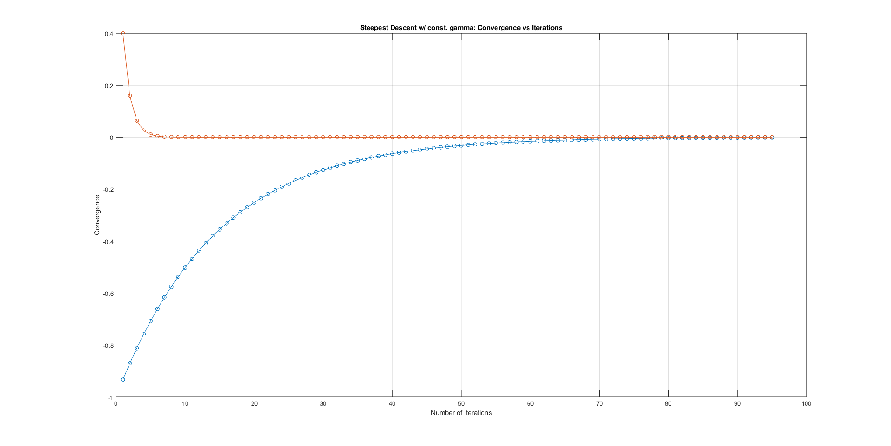
	<figcaption>Σύγκλισης της αντικειμενικής συνάρτησης ως προς τον αριθμό των απαιτούμενων επαναλήψεων κατά την εφαρμογή της μεθόδου της μέγιστης καθόδου με $\gamma_k=0.1$ και αρχικό σημείο το (-1, 1)</figcaption>
</figure>

<figure>
	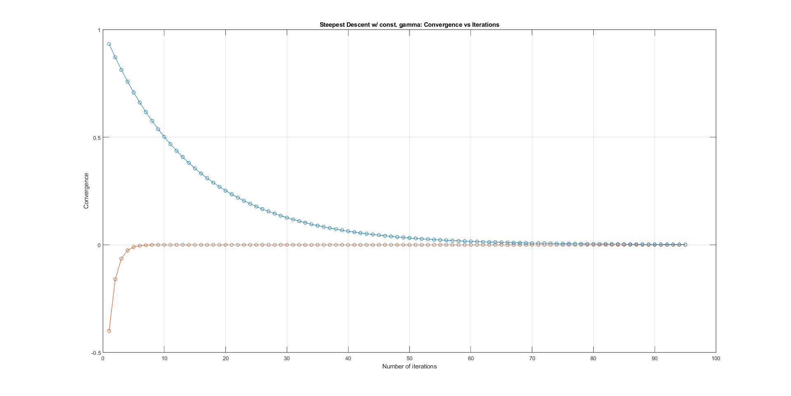
	<figcaption>Σύγκλισης της αντικειμενικής συνάρτησης ως προς τον αριθμό των απαιτούμενων επαναλήψεων κατά την εφαρμογή της μεθόδου της μέγιστης καθόδου με $\gamma_k=0.1$ και αρχικό σημείο το (1, -1)</figcaption>
</figure>

<figure>
	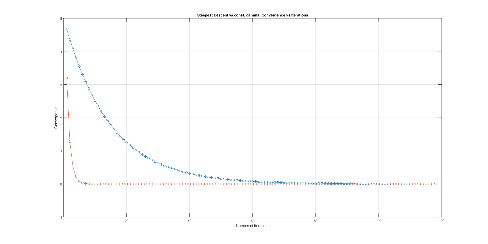
	<figcaption>Σύγκλισης της αντικειμενικής συνάρτησης ως προς τον αριθμό των απαιτούμενων επαναλήψεων κατά την εφαρμογή της μεθόδου της μέγιστης καθόδου με $\gamma_k=0.1$ και αρχικό σημείο το (5, 8)</figcaption>
</figure>

### ii) $\gamma_k=0.3$

- Με $(x_0, y_0) = (-1, 1)$: $x_{min} = (-0.00014, 0.00013)$
- Με $(x_0, y_0) = (1, -1)$: $x_{min} = (0.00013, -0.00014)$
- Με $(x_0, y_0) = (5, 8)$: $x_{min} = (0.00008, -0.00015)$

<figure>
	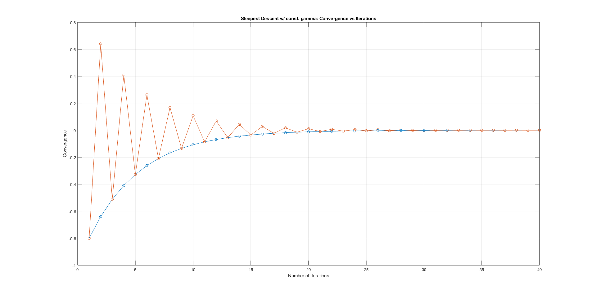
	<figcaption>Σύγκλισης της αντικειμενικής συνάρτησης ως προς τον αριθμό των απαιτούμενων επαναλήψεων κατά την εφαρμογή της μεθόδου της μέγιστης καθόδου με $\gamma_k=0.3$ και αρχικό σημείο το (-1, 1)</figcaption>
</figure>

<figure>
	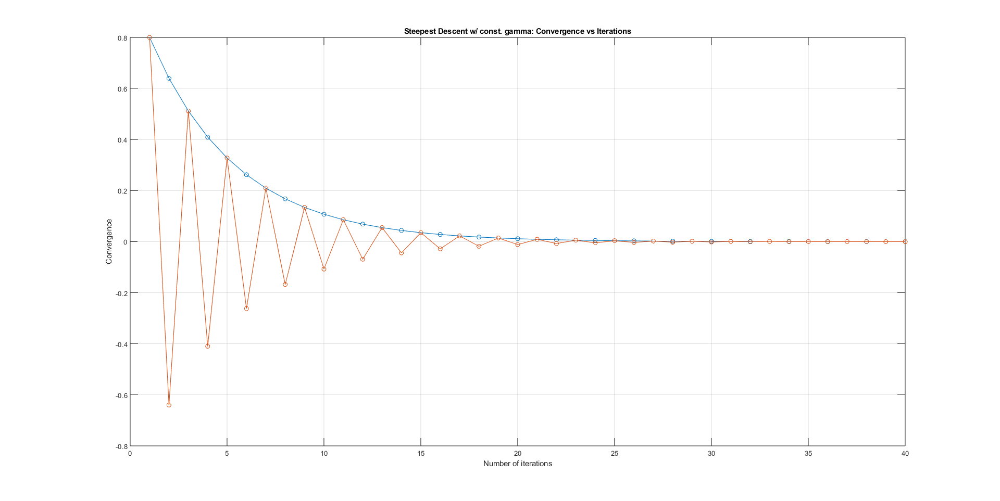
	<figcaption>Σύγκλισης της αντικειμενικής συνάρτησης ως προς τον αριθμό των απαιτούμενων επαναλήψεων κατά την εφαρμογή της μεθόδου της μέγιστης καθόδου με $\gamma_k=0.3$ και αρχικό σημείο το (1, -1)</figcaption>
</figure>

<figure>
	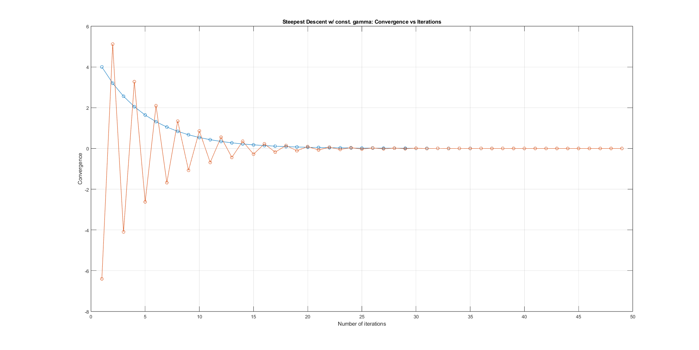
	<figcaption>Σύγκλισης της αντικειμενικής συνάρτησης ως προς τον αριθμό των απαιτούμενων επαναλήψεων κατά την εφαρμογή της μεθόδου της μέγιστης καθόδου με $\gamma_k=0.3$ και αρχικό σημείο το (5, 8)</figcaption>
</figure>

### iii) $\gamma_k=3$

- Με $(x_0, y_0) = (-1, 1)$: $x_{min} = (1.28609, 2405580062851.09473)$
- Με $(x_0, y_0) = (1, -1)$: $x_{min} = (-1.29058, -4922181737863.99609)$
- Με $(x_0, y_0) = (5, 8)$: $x_{min} = (5.01341, -1202595690034.25366)$

<figure>
	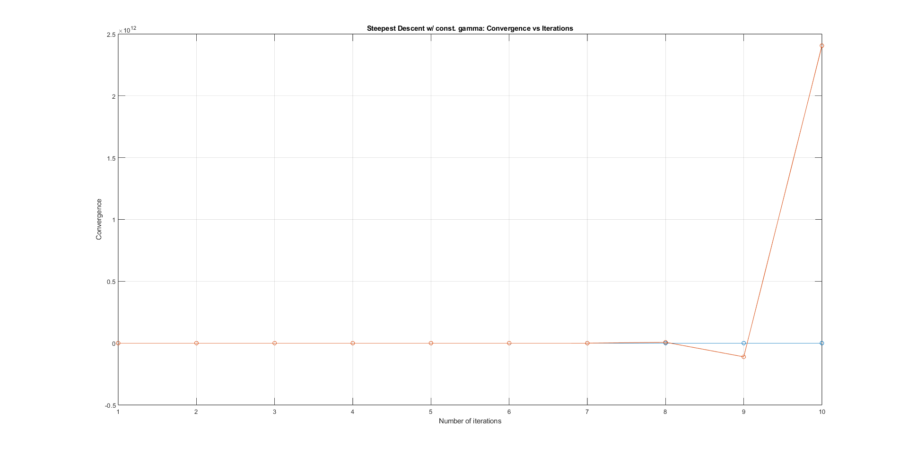
	<figcaption>Σύγκλισης της αντικειμενικής συνάρτησης ως προς τον αριθμό των απαιτούμενων επαναλήψεων κατά την εφαρμογή της μεθόδου της μέγιστης καθόδου με $\gamma_k=3$ και αρχικό σημείο το (-1, 1)</figcaption>
</figure>

<figure>
	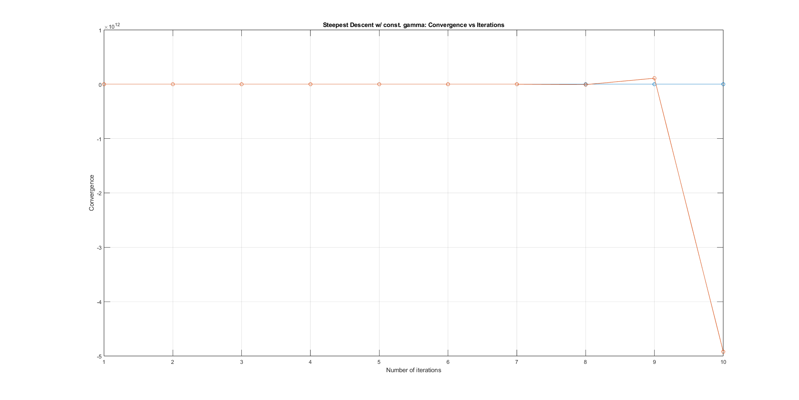
	<figcaption>Σύγκλισης της αντικειμενικής συνάρτησης ως προς τον αριθμό των απαιτούμενων επαναλήψεων κατά την εφαρμογή της μεθόδου της μέγιστης καθόδου με $\gamma_k=5$ και αρχικό σημείο το (1, -1)</figcaption>
</figure>

<figure>
	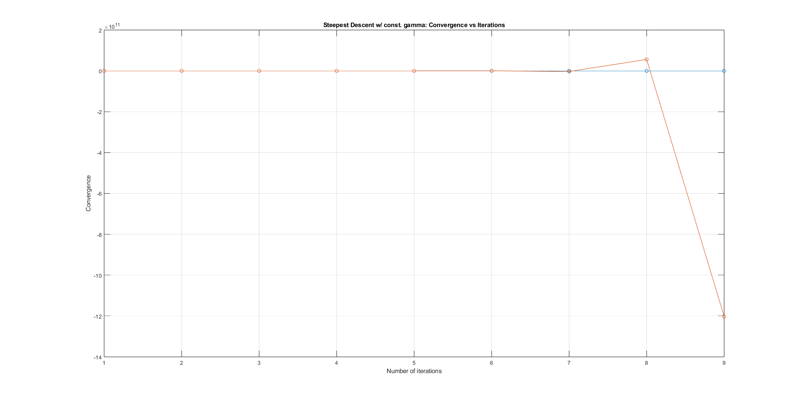
	<figcaption>Σύγκλισης της αντικειμενικής συνάρτησης ως προς τον αριθμό των απαιτούμενων επαναλήψεων κατά την εφαρμογή της μεθόδου της μέγιστης καθόδου με $\gamma_k=3$ και αρχικό σημείο το (5, 8)</figcaption>
</figure>

### iv) $\gamma_k=5$

- Με $(x_0, y_0) = (-1, 1)$: $x_{min} = (92.33537, 572626738778.61694)$
- Με $(x_0, y_0) = (1, -1)$: $x_{min} = (-92.45477, -506962739015.72992)$
- Με $(x_0, y_0) = (5, 8)$: $x_{min} = (142.48273, 4063899908250.92334)$

<figure>
	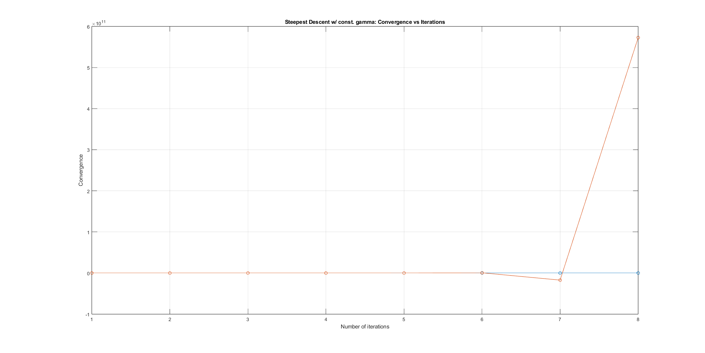
	<figcaption>Σύγκλισης της αντικειμενικής συνάρτησης ως προς τον αριθμό των απαιτούμενων επαναλήψεων κατά την εφαρμογή της μεθόδου της μέγιστης καθόδου με $\gamma_k=5$ και αρχικό σημείο το (-1, 1)</figcaption>
</figure>

<figure>
	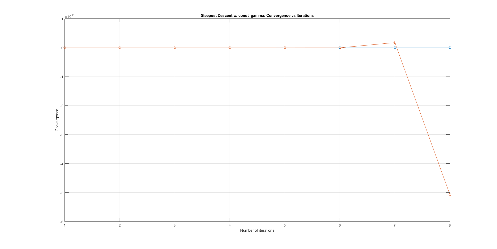
	<figcaption>Σύγκλισης της αντικειμενικής συνάρτησης ως προς τον αριθμό των απαιτούμενων επαναλήψεων κατά την εφαρμογή της μεθόδου της μέγιστης καθόδου με $\gamma_k=5$ και αρχικό σημείο το (1, -1)</figcaption>
</figure>

<figure>
	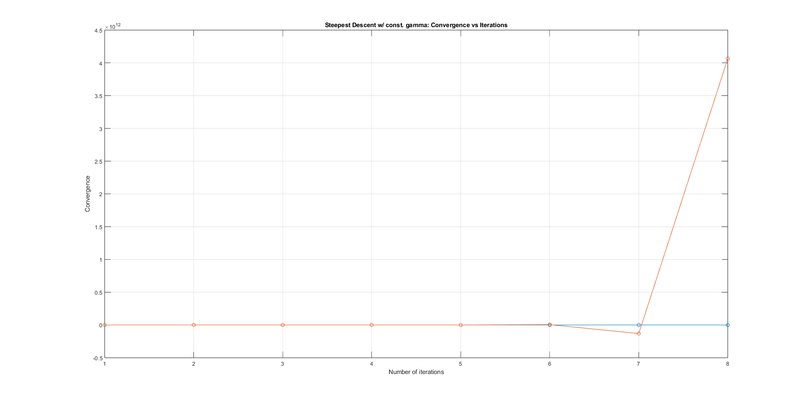
	<figcaption>Σύγκλισης της αντικειμενικής συνάρτησης ως προς τον αριθμό των απαιτούμενων επαναλήψεων κατά την εφαρμογή της μεθόδου της μέγιστης καθόδου με $\gamma_k=5$ και αρχικό σημείο το (5, 8)</figcaption>
</figure>

### Παρατηρήσεις

Σύμφωνα με τα παραπάνω, γίνεται σαφές ότι ανεξαρτήτως του αρχικού σημείου για $\gamma=0.1$ και $\gamma=0.3$ η αντικειμενική συνάρτηση συγκλίνει και ο αλγόριθμος προσεγγίζει το ελάχιστο της $f$ με αρκετά καλή ακρίβεια, ενώ για $\gamma=3$ και $\gamma=5$ ο αλγόριθμος επιστρέφει εμφανώς λάθος αποτέλεσμα. Η παρατήρηση αυτή θα εξηγηθεί με την παρακάτω απόδειξη:

### Απόδειξη

Θα αποδειχθεί ότι για να συγκλίνει η δοθείσα συνάρτηση στο ελάχιστό της πρέπει να επιλεχθεί $\gamma$ τέτοιο ώστε $0 < \gamma < \frac{1}{3}$.  

Έχουμε:
$$f(x)=\frac{1}{3}x_1^2+3x_2^2, x = [x_1, x_2]^{T}$$  

Οπότε:
$$\nabla f(x)=(\frac{2}{3}x_1, 6x_2)$$  

και
$$\nabla^2f(x)=\begin{pmatrix}
								\frac{2}{3} & 0\\
								0 & 6
								\end{pmatrix}$$  
                
Επομένως η κλήση της $f$ μπορεί να γραφεί ως εξής:
$$\nabla f(x)=\begin{pmatrix}
								\frac{2}{3} & 0\\
								0 & 6
								\end{pmatrix}\begin{pmatrix}
																x_1\\
																x_2\\
														 \end{pmatrix}=\nabla^2f(x)x$$  
                             
Κατά την μέθοδο της μέγιστης καθόδου έχουμε:
$$x_{k+1}=x_k-\gamma\nabla f(x_k)$$  
Το οποίο σύμφωνα με τα παραπάνω γίνεται:
$$x_{k+1}=x_k-\gamma\nabla^2f(x)x$$
Έστω λοιπόν ότι συμβολίζουμε $x^{\ast}$ το ελάχιστο της $f$ και $e_k$ την απόσταση του σημείου $x_k$ από το ελάχιστο, δηλαδή:
$$e_k=x_k-x^{\ast}$$
Αφαιρώντας κατά μέλη $x^{\ast}$ από την προηγούμενη εξίσωση παίρνουμε:
$$x_{k+1}-x^{\ast}=x_k-x^{\ast}-\gamma\nabla^2 f(x_k)x$$  
Επιπλέον, επειδή $x^{\ast}=\begin{pmatrix}
																						 0\\
																						 0
												\end{pmatrix}$ έχουμε:
$$x_{k+1}-x^{\ast}=x_k-x^{\ast}-\gamma\nabla^2 f(x_k)(x-x^{\ast})$$
Αντικαθιστώντας στην παραπάνω εξίσωση $e_k=x_k-x^{\ast}$ γίνεται:
$$e_{k+1}=e_k-\gamma\nabla^2 f(x_k)e_k$$
ή αλλιώς:
$$e_{k+1}=(I-\gamma\nabla^2 f(x_k))e_k$$
Για να υπάρξει σύγκλιση πρέπει το μέτρο της απόστασης από το ελάχιστο να γίνεται μικρότερο σε κάθε επανάληψη, δηλαδή:
$$|e_{k+1}|<|e_k|$$
Το οποίο με την σειρά του προϋποθέτει ότι:
$$||(I-\gamma\nabla^2 f(x_k))||<1\Rightarrow$$
$$|1-\gamma\lambda_i|<1$$
όπου $\lambda_i$ είναι η μεγαλύτερη ιδιοτιμή του $(I-\gamma\nabla^2 f(x_k))$.
Επομένως, έχουμε:
$$-1<1-\gamma\lambda_i<1\Rightarrow$$
$$-2<-\gamma\lambda_i<0$$
και εφόσον $\lambda_i>0 \iff -\lambda_i<0$.
$$0<\gamma<\frac{2}{\lambda_i}$$
Με $\lambda_i=6$ όπως ισχύει για την δοσμένη αντικειμενική συνάρτηση, καταλήγουμε στον εξής περιορισμό:
$$0<\gamma<\frac{1}{3}$$
Τα παραπάνω αποδεικνύουν, λοιπόν, πως η συνάρτηση συγκλίνει στο ελάχιστο για $\gamma=0.1$ ή $\gamma=0.3$, ενώ όχι για $\gamma=3$ ή $\gamma=5$.

## Θέμα 2ο

Για το 2ο, 3ο και 4ο θέμα εισάγονται οι εξής περιορισμοί:
$$-10 \leq x_1 \leq 5 , -8 \leq x_2 \leq 12.$$
Για να συμπεριληφθούν οι παραπάνω περιορισμοί στην εύρεση του ελαχίστου, θα γίνει χρήση της μεθόδου της μέγιστης καθόδου με προβολή, η οποία στο 2ο θέμα ζητείται να εφαρμοστεί με $s_k=5$, $\gamma_k=0.5$, σημείο εκκίνησης το (5, -5) και ακρίβεια $\epsilon=0.01$.

### Αποτελέσματα

Κατά την εφαρμογή της μεθόδου της μέγιστης καθόδου με προβολή, με $s_k$, $\gamma_k$, $\epsilon$ και αρχικό σημείο επιλεγμένα σύμφωνα με την εκφώνηση δεν υπάρχει σύγκληση στο ελάχιστο. Αντ' αυτού ύστερα από περίπου 20 επαναλήψεις παρατηρείται ταλάντωση μεταξύ δύο σημείων.

<figure>
	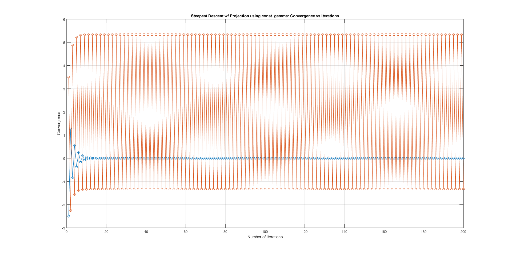
	<figcaption>Σύγκλισης της αντικειμενικής συνάρτησης ως προς τον αριθμό των απαιτούμενων επαναλήψεων κατά την εφαρμογή της μεθόδου της μέγιστης καθόδου με προβολή, όπου $\gamma=0.5$, $s=5$, $\epsilon=0.01$ και αρχικό σημείο το (5, -5)</figcaption>
</figure>

### Παρατηρήσεις

Στο 1ο θέμα αποδείχτηκε πως για να υπάρχει σύγκλιση κατά την εφαρμογή της μεθόδου της μέγιστης καθόδου (στην συγκεκριμένη αντικειμενική συνάρτηση) πρέπει να επιλεχθεί $\gamma$ τέτοιο ώστε $\gamma<\frac{1}{3}$. Στο 2ο θέμα ζητήθηκε να επιλεγεί $\gamma=0.5>\frac{1}{3}$ και όπως αναμενόταν δεν υπήρξε σύγκλιση.  
Παρ' όλ' αυτά, ύστερα από δοκιμές, παρατηρήθηκε πως ακόμα και στην περίπτωση που επιλεχθεί $\gamma=0.1<\frac{1}{3}$ δεν θα υπάρξει σύγκλιση. Σύγκλιση υπήρξε μόνο αφότου επιλέχθηκε $s\leq3$ ή $s\geq6$. Επομένως, φαίνεται πως παρουσία περιορισμών, όπου εφαρμόζεται η μέθοδος της μέγιστης καθόδου με προβολή, η συνθήκη $\gamma<\frac{1}{3}$ είναι μεν αναγκαία, δεν είναι όμως ικανή για να υπάρξει σύγκλιση. Ακολουθούν γραφήματα που περιγράφουν οπτικά τα παραπάνω:

<figure>
	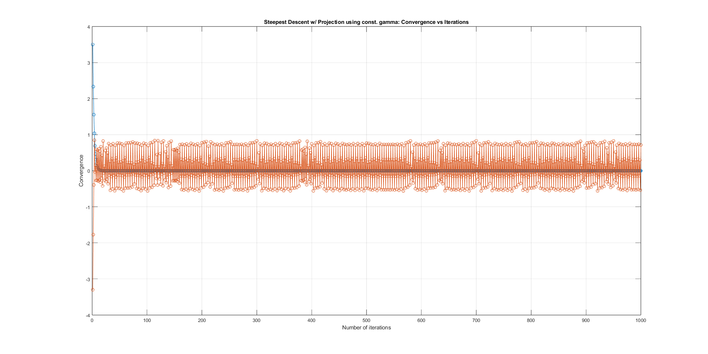
	<figcaption>Σύγκλισης της αντικειμενικής συνάρτησης ως προς τον αριθμό των απαιτούμενων επαναλήψεων κατά την εφαρμογή της μεθόδου της μέγιστης καθόδου με προβολή, όπου $\gamma=0.1$, $s=5$, $\epsilon=0.01$ και αρχικό σημείο το (5, -5)</figcaption>
</figure>

<figure>
	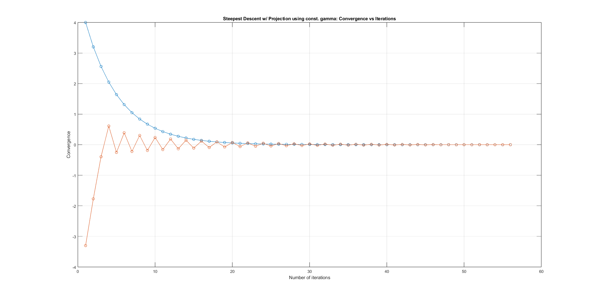
	<figcaption>Σύγκλισης της αντικειμενικής συνάρτησης ως προς τον αριθμό των απαιτούμενων επαναλήψεων κατά την εφαρμογή της μεθόδου της μέγιστης καθόδου με προβολή, όπου $\gamma=0.1$, $s=3$, $\epsilon=0.01$ και αρχικό σημείο το (5, -5)</figcaption>
</figure>

<figure>
	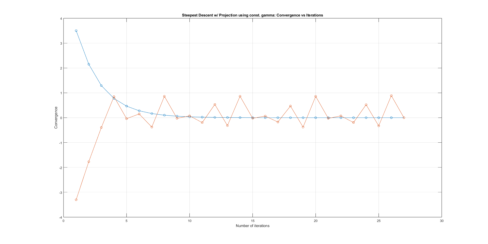
	<figcaption>Σύγκλισης της αντικειμενικής συνάρτησης ως προς τον αριθμό των απαιτούμενων επαναλήψεων κατά την εφαρμογή της μεθόδου της μέγιστης καθόδου με προβολή, όπου $\gamma=0.1$, $s=6$, $\epsilon=0.01$ και αρχικό σημείο το (5, -5)</figcaption>
</figure>

## Θέμα 3ο

Στο 3ο θέμα ζητείται να εφαρμοστεί η μέθοδος της μέγιστης καθόδου με προβολή, όπου $s_k=15$, $\gamma_k=0.1$, σημείο εκκίνησης το (-5, 10) και ακρίβεια $\epsilon=0.01$.

### Αποτελέσματα

Κατά την εφαρμογή της μεθόδου της μέγιστης καθόδου με προβολή, όπου οι παράμετροι επιλέχθηκαν όπως στην εκφώνηση το ελάχιστο της αντικειμενικής συνάρτησης υπολογίστηκε επιτυχώς. Ο αλγόριθμος επέστρεψε $x_{min} = (-0.00000, 0.00060)$ ύστερα από 328 επαναλήψεις.

<figure>
	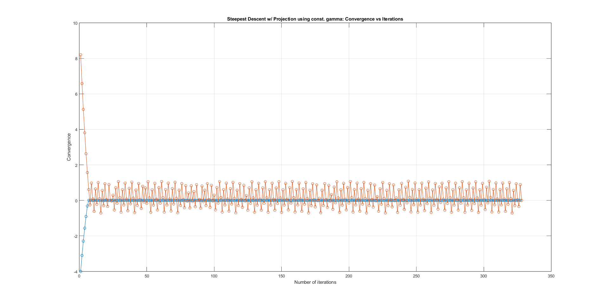
	<figcaption>Σύγκλισης της αντικειμενικής συνάρτησης ως προς τον αριθμό των απαιτούμενων επαναλήψεων κατά την εφαρμογή της μεθόδου της μέγιστης καθόδου με προβολή, όπου $\gamma=0.1$, $s=15$, $\epsilon=0.01$ και αρχικό σημείο το (-5, 10)</figcaption>
</figure>

### Παρατηρήσεις

Όσα παρατηρούνται κατά την εφαρμογή του αλγορίθμου με τις παραμέτρους επιλεγμένες σύμφωνα με την εκφώνηση του 3ου θέματος συμβαδίζουν με όσα παρατηρήθηκαν στα δύο προηγούμενα, δηλαδή ότι για να υπάρξει σύγκλιση πρέπει να επιλεχθεί $\gamma<\frac{1}{3}$ και $s\leq3$ ή $s\geq6$.  
Ένας, λοιπόν, απλός πρακτικός τρόπος ώστε να συγκλίνει η συνάρτηση είναι να επιλεγούν $\gamma=0.1$ και $s\leq3$ ή $s\geq6$, όμως όχι πολύ μικρό ή πολύ μεγάλο, καθώς αυτό θα αυξήσει σημαντικά τον αριθμό των απαιτούμενων επαναλήψεων, άρα θα κάνει τον αλγόριθμο λιγότερο αποτελεσματικό. Μία προτεινόμενη επιλογή είναι η εξής: $\gamma=0.1$ και $s=2$. Ακολουθεί γράφημα της σύγκλισης της συνάρτησης κατά την επιλογή αυτή:

<figure>
	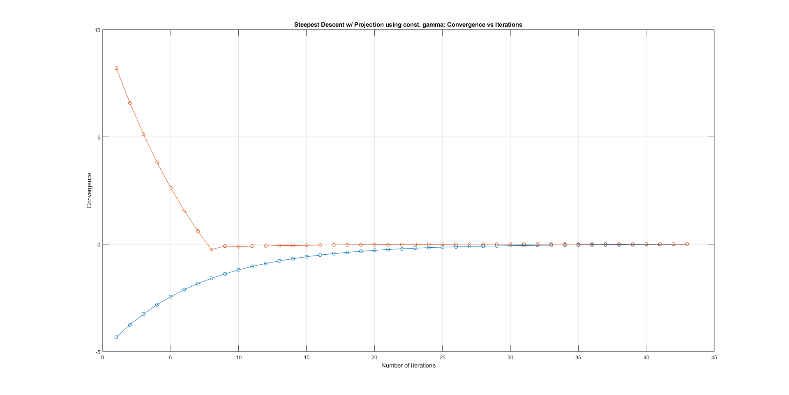
	<figcaption>Σύγκλισης της αντικειμενικής συνάρτησης ως προς τον αριθμό των απαιτούμενων επαναλήψεων κατά την εφαρμογή της μεθόδου της μέγιστης καθόδου με προβολή, όπου $\gamma=0.1$, $s=2$, $\epsilon=0.01$ και αρχικό σημείο το (-5, 10)</figcaption>
</figure>

## Θέμα 4ο

Στο 4ο θέμα ζητείται να εφαρμοστεί η μέθοδος της μέγιστης καθόδου με προβολή, όπου $s_k=0.1$, $\gamma_k=0.2$, σημείο εκκίνησης το (8, -10) και ακρίβεια $\epsilon=0.01$. Πριν γίνει εκτέλεση του αλγορίθμου, τίθεται το ερώτημα εάν υπάρχει εκ των προτέρων κάποια πληροφορία για την σύγκλιση του αλγορίθμου.  
Δεδομένου ότι $\gamma_k=0.2<\frac{1}{3}$ και $s_k=0.1<3$ προβλέπεται σύμφωνα με τις παρατηρήσεις των προηγούμενων θεμάτων ότι ο αλγόριθμος θα συγκλίνει, όμως θα χρειαστούν πολλές επαναλήψεις λόγω του γεγονότος ότι το $s$ επιλέχθηκε πολύ μικρό.

### Αποτελέσματα

Αφότου εκτελεστεί, ο αλγόριθμος, πράγματι, συγκλίνει στο ελάχιστο ύστερα από 581 επαναλήψεις:

<figure>
	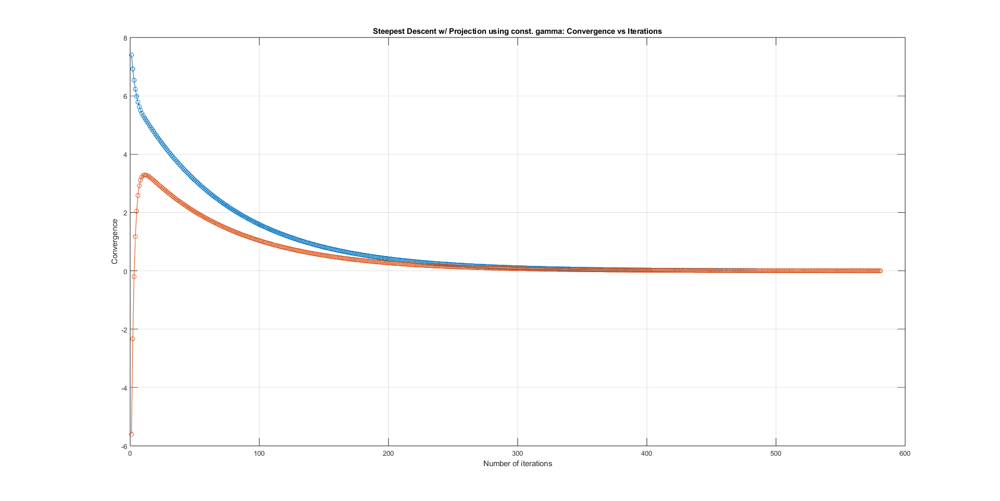
	<figcaption>Σύγκλισης της αντικειμενικής συνάρτησης ως προς τον αριθμό των απαιτούμενων επαναλήψεων κατά την εφαρμογή της μεθόδου της μέγιστης καθόδου με προβολή, όπου $\gamma=0.2$, $s=0.1$, $\epsilon=0.01$ και αρχικό σημείο το (8, -10)</figcaption>
</figure>

## Συμπεράσματα

Το παρόν θέμα αφορά την ελαχιστοποίηση της δοσμένης συνάρτησης με περιορισμούς μέσω της μεθόδου της μέγιστης καθόδου με προβολή. Από την ανάλυση προκύπτει ότι για την συγκεκριμένη συνάρτηση η επιλογή του $\gamma$ και του $s$ είναι καθοριστική. Η τιμή $\gamma<\frac{1}{3}$ φαίνεται αναγκαία για σύγκλιση, όμως δεν επαρκεί από μόνη της, αφού η επιλογή του $s$ επηρεάζει εξίσου έντονα τη συμπεριφορά του αλγορίθμου.  
Πρακτικά, οι καλύτερες επιδόσεις προκύπτουν όταν επιλέγονται συνδυασμοί όπως $\gamma=0.1$ και $s=2$, ενώ πολύ μικρές τιμές του $s$ αυξάνουν σημαντικά τον αριθμό επαναλήψεων. Συνεπώς, η σωστή ρύθμιση των παραμέτρων είναι απαραίτητη για να επιτευχθεί τόσο σύγκλιση όσο και καλή αποδοτικότητα.
